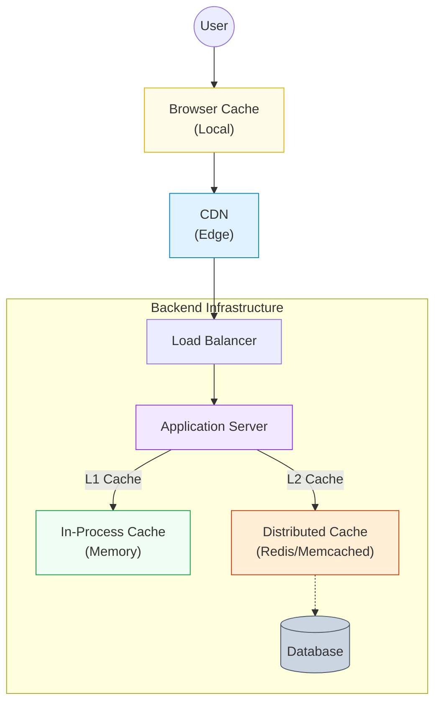
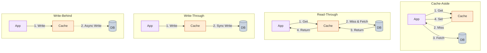

# Caching

Caching is the practice of storing copies of data in a high-speed storage layer (usually RAM) to serve future requests faster. In system design, it is the primary mechanism for reducing **latency** and increasing **throughput**.

## 1. Where Does Cache Exist?

Caching happens at every layer of a distributed system.

*   **Client Side**: Browser caching (HTTP headers), LocalStorage.
*   **CDN (Content Delivery Network)**: Caches static assets (images, CSS, JS) at the "edge" closest to the user.
*   **Load Balancer**: Can cache TLS sessions or simple API responses.
*   **In-Process (Application)**: Local memory cache (e.g., Java Heap, Guava). Fastest, but limited by instance memory.
*   **External (Distributed)**: Remote cache cluster (e.g., Redis, Memcached). Shared across all instances.

---

## 2. Cache Architectures

How do you keep the cache and the database in sync?

### Cache-Aside (Lazy Loading)
The **Application** is responsible for orchestrating the data flow.
1.  App checks Cache.
2.  If **Miss**: App reads from DB, then updates Cache.
3.  If **Write**: App writes to DB, then **invalidates** (deletes) the cache entry.
*   **Pros**: Resilient to cache failure. Data model in cache can differ from DB.
*   **Cons**: First request is slow (cold start).

### Write-Through
The Application treats the Cache as the main data store.
1.  App writes to Cache.
2.  Cache synchronously writes to DB.
*   **Pros**: Strong consistency. No lost data.
*   **Cons**: Higher write latency (2 writes).

### Write-Behind (Write-Back)
App writes to Cache, and Cache **asynchronously** writes to DB.
*   **Pros**: Insanely fast writes.
*   **Cons**: **Data Loss Risk** if cache crashes before sync.

### Read-Through
The Application asks the Cache for data. If it's a **Miss**, the **Cache** (not the App) fetches it from the DB, updates itself, and returns the value.
*   **Pros**: Simplifies application code (App doesn't care about DB).
*   **Cons**: Tighter coupling between Cache and DB model.

---

## 3. Eviction Policies

When the cache is full, what do you delete?

*   **LRU (Least Recently Used)**: Evict the item that hasn't been used for the longest time.
    *   *Best For*: Most social/web apps where "recent" = "popular".
*   **LFU (Least Frequently Used)**: Evict the item with the fewest total hits.
    *   *Best For*: Stable access patterns (e.g., homepage content).
*   **FIFO (First In First Out)**: Evict the oldest item.
    *   *Best For*: Rarely used.
*   **TTL (Time To Live)**: Items expire after a fixed time (e.g., 5 minutes). Used in combination with others.

---

## 4. Common Cache Problems

### Cache Stampede (Thundering Herd)
A popular key (e.g., "Justin Bieber Profile") expires. Suddenly, 10,000 concurrent requests all miss the cache and hit the database simultaneously, crashing it.
*   **Solution 1: Request Coalescing**. The first request gets a "lock" to compute the value. The other 9,999 wait for the first one to finish and use the result.
*   **Solution 2: Cache Warming**. A background cron job continually refreshes the key before it expires.
*   **Solution 3: Jitter**. Add random time to TTLs so keys don't all expire at the exact same millisecond.

### Hot Keys
A single key (e.g., "Breaking News") gets so much traffic it overwhelms the single Redis node it lives on.
*   **Solution 1: Local / Client Caching**. Cache it directly in the application memory (L1 cache) to skip the network call.
*   **Solution 2: Key Splitting**. Replicate the key to multiple nodes (`key_1`, `key_2`, `key_3`) and have clients pick a random replica.

### Cache Consistency
Keeping Cache and DB in sync is one of the hardest problems in CS.
*   **Invalidation is preferred over Update**. When data changes, just `DELETE` the key. It's safer than trying to `SET` the new value (race conditions).

---

## 5. When to Cache?

Don't optimize prematurely. Cache when:
1.  **Read-Heavy Workload**: 80/20 rule (20% of data is read 80% of the time).
2.  **Expensive Computations**: Aggregations, image processing.
3.  **High Database Load**: The DB CPU is pegged despite optimized queries. Caching prevents simple reads from burning expensive CPU cycles.
4.  **Tolerable Staleness**: It's okay if the "View Count" is 5 seconds old.
