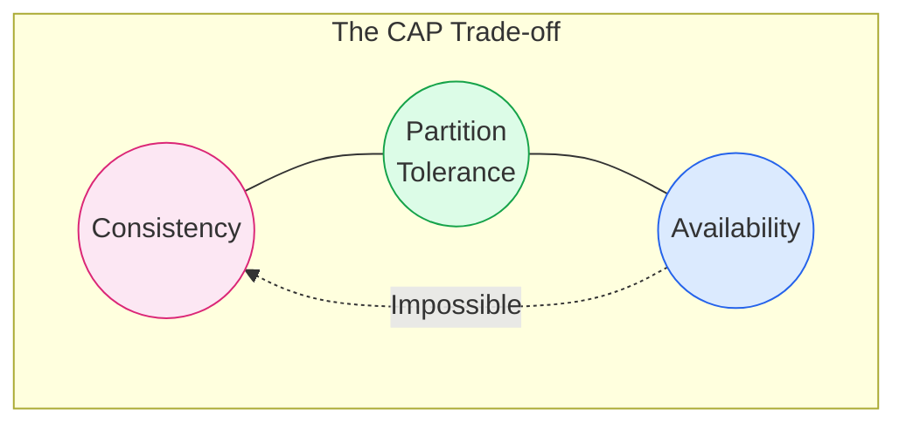
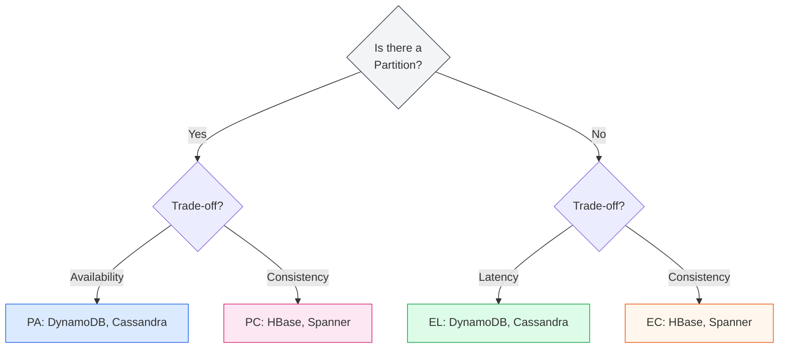

# CAP Theorem & Numbers to Know

In Distributed Systems, physics and network realities force us to make trade-offs. The CAP theorem describes the most fundamental of these trade-offs.

## 1. CAP Theorem

The theorem states that a distributed data store can effectively provide only **two** of the following three guarantees:

*   **Consistency (C)**: Every read receives the most recent write or an error. (All nodes see the same data at the same time).
*   **Availability (A)**: Every request receives a (non-error) response, without the guarantee that it contains the most recent write. (The system stays up).
*   **Partition Tolerance (P)**: The system continues to operate despite an arbitrary number of messages being dropped or delayed by the network between nodes. (The network *will* fail).

### The "Pick Two" Dilemma
In a distributed system, **Partitions (P) are inevitable**. Networks fail, cables get cut. Therefore, you must typically choose between **CP** (Consistency) and **AP** (Availability) when a partition occurs.

*   **CP (Consistency + Partition Tolerance)**:
    *   *Behavior*: If nodes cannot communicate, the system **stops accepting writes** to preserve consistency.
    *   *Example*: **Banking System**. It's better to return an error than to allow an ATM withdrawal if the balance can't be confirmed.
    *   *Tech*: HBase, MongoDB (default), Redis (default), Zookeeper.

*   **AP (Availability + Partition Tolerance)**:
    *   *Behavior*: If nodes cannot communicate, the system **accepts writes** on both sides of the partition, even if they conflict. They are resolved later (Eventual Consistency).
    *   *Example*: **Social Media Feed**. It's better to show an old post than to show an error page.
    *   *Tech*: Cassandra, DynamoDB, CouchDB.

---

## 2. PACELC Theorem

CAP only explains what happens *during* a partition. But what about normal operation? **PACELC** extends CAP:

> If there is a Partition (**P**), how does the system trade off Availability and Consistency (**A** or **C**)?
>
> **E**lse (**E**), when the system is running normally, how does it trade off Latency and Consistency (**L** or **C**)?

*   **L vs C**: If you want perfect consistency (C), you need to replicate data to all nodes before returning, which increases **Latency (L)**. If you want low latency, you return immediately and replicate asynchronously (sacrificing Consistency).

---

## 3. Numbers Everyone Should Know (2024)

Understanding the "Orders of Magnitude" is more important than exact values.

### Latency "Cheat Sheet"
| Action | Time | Human Scale |
| :--- | :--- | :--- |
| **L1 Cache Reference** | 0.5 ns | ~0.5 s (Heartbeat) |
| **L2 Cache Reference** | 7 ns | ~7 s (Yawn) |
| **Mutex Lock/Unlock** | 100 ns | ~1.5 min (Coffee) |
| **Main Memory Reference** | 100 ns | ~1.5 min |
| **Compress 1KB (Zippy)** | 10,000 ns (10 µs) | ~2.5 hrs (Lunch) |
| **Send 2KB over 1Gbps** | 20,000 ns (20 µs) | ~5 hrs (Work day) |
| **SSD Random Read** | 150,000 ns (150 µs) | ~1.5 days |
| **Read 1MB sequentially (Mem)** | 250,000 ns (250 µs) | ~3 days |
| **Round Trip (Same Datacenter)** | 500,000 ns (0.5 ms) | ~6 days |
| **Disk Seek (HDD)** | 10,000,000 ns (10 ms) | ~4 months |
| **Packet CA -> Netherlands -> CA** | 150,000,000 ns (150 ms) | ~5 years |

### Throughput / Capacity Rules of Thumb
Use these ballpark figures to estimate how many servers you need.

*   **Redis / Memcached (Single Node)**
    *   **~100,000 QPS**. In-memory is incredibly fast. CPU is usually the bottleneck.
*   **SQL Database (Postgres/MySQL - Single Node)**
    *   **~10,000 TPS** (Transactions Per Second). Disk I/O and ACID guarantees limit speed.
*   **NoSQL (Cassandra/DynamoDB Partition)**
    *   **~3,000 Read Units / 1,000 Write Units**. Per partition limits. You scale by adding more partitions.
*   **Kafka (Single Partition)**
    *   **~100,000 Messages/sec**. Sequential disk I/O is very fast.

### Availability Math
High availability is measured in "9s".

| Availability | Downtime per Year |
| :--- | :--- |
| **99% (2 nines)** | 3.65 days |
| **99.9% (3 nines)** | 8.76 hours |
| **99.99% (4 nines)** | 52.6 minutes |
| **99.999% (5 nines)** | 5.26 minutes |
