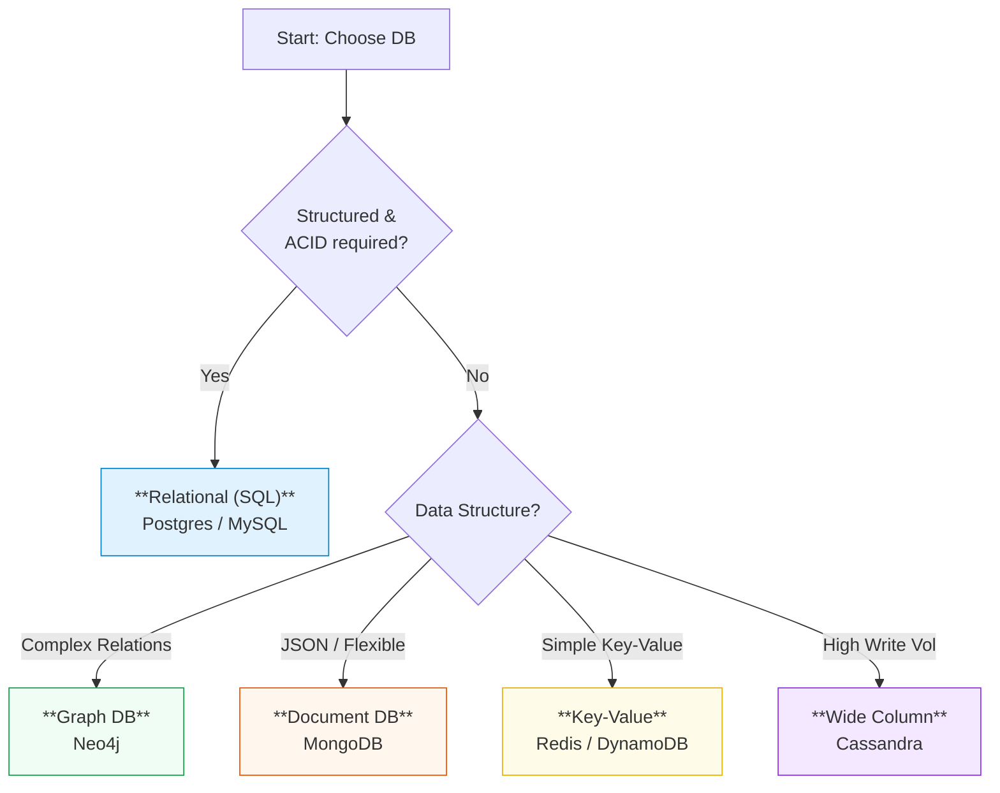
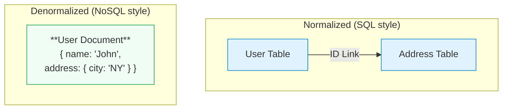

# Data Modelling

Data modelling is the blueprint of system design. It involves defining how data is stored, organized, and accessed to meet the system's functional and non-functional requirements. In an interview, choosing the wrong data model can be a fatal design flaw that makes scaling impossible.

## 1. Data Model Options

You generally choose between five major archetypes.

### Relational (SQL)
*   **Structure**: Tables with rows and columns. Strict schema.
*   **Key Features**: **ACID** transactions (Atomicity, Consistency, Isolation, Durability), SQL joins, referential integrity (FK constraints).
*   **Examples**: PostgreSQL, MySQL.
*   **Best For**: Financial systems, complex relationships, structured data where consistency is non-negotiable.

### Document (NoSQL)
*   **Structure**: JSON-like documents. Flexible, schema-less.
*   **Key Features**: Denormalized data (data locality), horizontal scaling.
*   **Examples**: MongoDB, Firestore, CouchDB.
*   **Best For**: Content management, user profiles, rapidly evolving product catalogs.

### Key-Value Stores
*   **Structure**: Simple Key -> Value mapping.
*   **Key Features**: O(1) reads/writes. Ultra-low latency.
*   **Examples**: Redis, DynamoDB, Memcached.
*   **Best For**: Caching, session management, shopping carts.

### Wide Column
*   **Structure**: 2D Key-Value store. Sparse columns.
*   **Key Features**: Optimised for massive write throughput and time-series data.
*   **Examples**: Cassandra, HBase.
*   **Best For**: Metrics collection, audit logs, IoT sensor data.

### Graph
*   **Structure**: Nodes (entities) and Edges (relationships).
*   **Key Features**: O(1) relationship traversal.
*   **Examples**: Neo4j, Amazon Neptune.
*   **Best For**: Social networks, recommendation engines, fraud detection.

### 🧠 Database Decision Tree

---

## 2. Schema Design

Good schema design is about balancing data integrity with performance requirements.

### Entities, Keys, Relationships
*   **Referential Integrity**: Ensuring that relationships between tables remain consistent. If a User is deleted, what happens to their Orders? (Cascade delete vs. Set Null).
*   **Constraints**: Rules enforced at the database level (e.g., `UNIQUE`, `NOT NULL`, `CHECK`) to prevent invalid data from entering the system.

### Indexing based on Access Pattern
Indexes are the single most impactful optimization for read performance.
*   **B-Trees**: The default for most DBs. Good for range queries (`<`, `>`, `ORDER BY`) and equality. Time complexity: O(log N).
*   **Hash Indexes**: strictly for equality checks (`=`). Ultra-fast O(1) lookups but cannot handle range queries.

### Normalization vs Denormalization

Once you pick a database, you must design the schema. This is a tug-of-war between **Normalization** and **Denormalization**.

### Normalization (The "Write" Approach)
*   **Goal**: Reduce redundancy. Data exists in only one place.
*   **Pros**: Consistency is automatic. Updates are fast (only update 1 row).
*   **Cons**: Reads are slow (need expensive Joins).
*   **Pattern**: 'Star Schema' or traditional 3NF.

### Denormalization (The "Read" Approach)
*   **Goal**: Optimize read performance by collecting data together.
*   **Technique**: Store redundant data. Embed the "City" name in the "User" table so you don't have to join with the "Cities" table.
*   **Pros**: Reads are O(1) and insanely fast.
*   **Cons**: Updates are heavy (must find all copies of data to update). Risk of inconsistent data.
*   **Best For**:
    *   **Analytics & Audit Systems**: Where historical data shouldn't change.
    *   **Heavily Read-Optimized**: User feeds, product pages.
*   **Common Pattern**: A **denormalized cache** (Redis) sitting in front of a **normalized source of truth** (PostgreSQL).

---

## 3. Scaling and Sharding

When data exceeds the capacity of a single server, you must **Shard** (partition) it.

### Sharding Strategies

1.  **Shard by Primary Access Pattern**: Always shard by the key you query most (e.g., `User_ID` for a social network).
2.  **Avoid Cross-Shard Queries**: These are expensive "scatter-gather" operations. If you shard by `User_ID`, querying by `City` requires checking *every* shard.
3.  **Consistent Hashing**: Used to distribute keys evenly across shards and minimize data movement when resizing the cluster.
