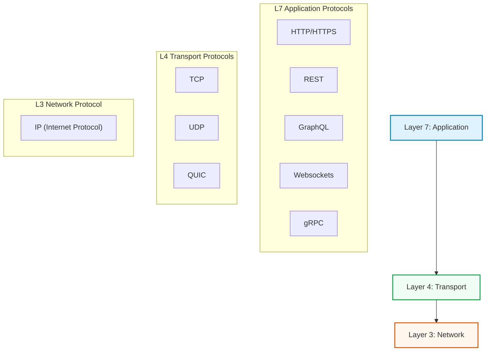
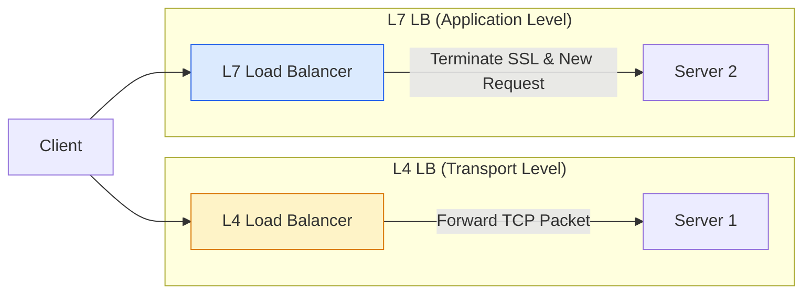
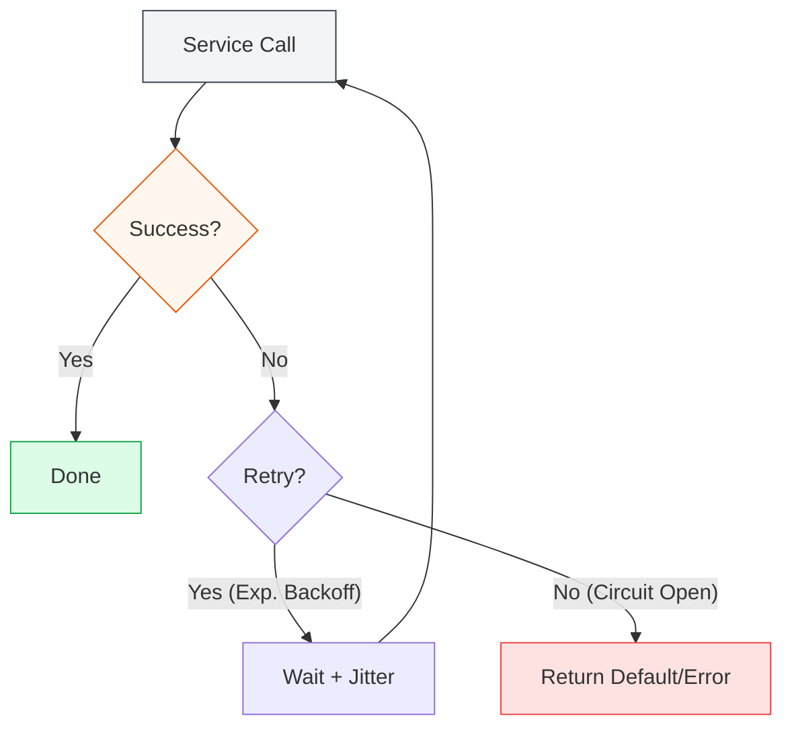

# Network Protocols

Networking is the invisible circulatory system of modern distributed applications. It defines how data moves from point A to point B, how reliable that movement is, and how components talk to each other.

For system design, you don't need to be a network engineer, but you must understand the **layers of abstraction** and the **trade-offs** between different protocols.

## The Open Systems Interconnection (OSI) Model

While there are 7 layers in the OSI model, as a backend or full-stack engineer, you primarily care about layers 3, 4, and 7.

---

## Application Layer (L7)

This is where your code lives. These protocols define the format of the data being exchanged.

### Request/Response Protocols

*   **HTTP/HTTPS (HyperText Transfer Protocol)**: The bedrock of the web. Stateless text-based protocol.
    *   **REST (Representational State Transfer)**: Resource-oriented architecture style using standard HTTP verbs (GET, POST, PUT, DELETE). State of the art for public APIs.
    *   **GraphQL**: A query language for APIs. Allows clients to request exactly the data they need. Solves over-fetching and under-fetching.

### Real-time Communication

*   **WebSockets**: Provides full-duplex communication channels over a single TCP connection. Ideal for chat apps, live sports updates, and collaborative editing.
*   **SSE (Server-Sent Events)**: One-way communication from server to client. Great for news feeds or status updates where the client doesn't need to send much back.
*   **WebRTC**: Designed for peer-to-peer audio and video streaming.

### Internal Service Communication

*   **gRPC**: High-performance, open-source framework by Google. Uses **Protocol Buffers (Protobuf)** (binary format) instead of JSON for smaller payloads and faster serialization. Great for microservices.

---

## Transport Layer (L4)

L4 handles the transmission of data packets and reliability.

### TCP vs UDP

| Feature | **TCP (Transmission Control Protocol)** | **UDP (User Datagram Protocol)** |
| :--- | :--- | :--- |
| **Reliability** | **Reliable.** Guarantees delivery and order. Retransmits lost packets. | **Unreliable.** Fire and forget. No guarantee of order or delivery. |
| **Speed** | Slower (due to "handshake" and ack overhead). | Faster (minimal overhead). |
| **Use Case** | Web browsing, Email, File transfer, APIs. | Video streaming (gaming), VoIP, DNS usually. |

### QUIC
A newer protocol built on top of UDP to fix some of TCP's shortcomings (like head-of-line blocking) while maintaining security and reliability. used heavily by HTTP/3.

---

## Load Balancing

Load balancers (LBs) are the gatekeepers that distribute incoming traffic across multiple servers. They can operate at different layers.

*   **L4 Load Balancer**: Works at the packet level (IP Address + Port). It just forwards packets. Very fast, very high throughput. Often used for DNS or simple TCP forwarding.
    *   *Examples:* Nginx (stream mode), HAProxy (TCP mode), AWS Network Load Balancer.
*   **L7 Load Balancer**: Works at the application level (HTTP). It can read headers, cookies, and URL paths. It terminates the connection and opens a new one to the backend server.
    *   *Examples:* Nginx (http mode), AWS Application Load Balancer.

---

## Resiliency Patterns

Distributed systems fail. These patterns keep your service alive when they do.

### 1. Circuit Breaker
If a service is failing repeatedly, stop calling it. "Trip the breaker" to fail fast and prevent system overload. After a timeout, let a few requests through to test if it's recovered.

### 2. Exponential Backoff + Jitter
When retrying a failed request, don't retry immediately. Wait 1s, then 2s, then 4s... This prevents a "thundering herd" where all clients retry at once and DDoS the recovering server. Adding "Jitter" (randomness) ensures retries are spread out.

### 3. Idempotency
An idempotent API call can be repeated multiple times without changing the result beyond the initial application.
*   `POST /users` is **NOT** idempotent (call it twice -> two users).
*   `PUT /users/123/email` **IS** idempotent (call it twice -> email is updated once).
Crucial for retry logic.

### 4. CDN (Content Delivery Network)
Push static assets (images, JS, CSS) to servers geographically closer to the user. Reduces latency and load on your main servers.
