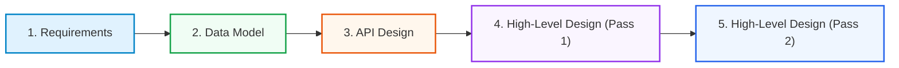
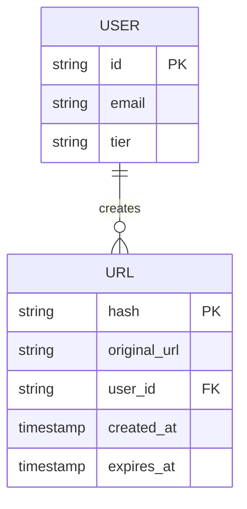
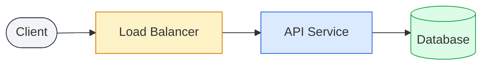
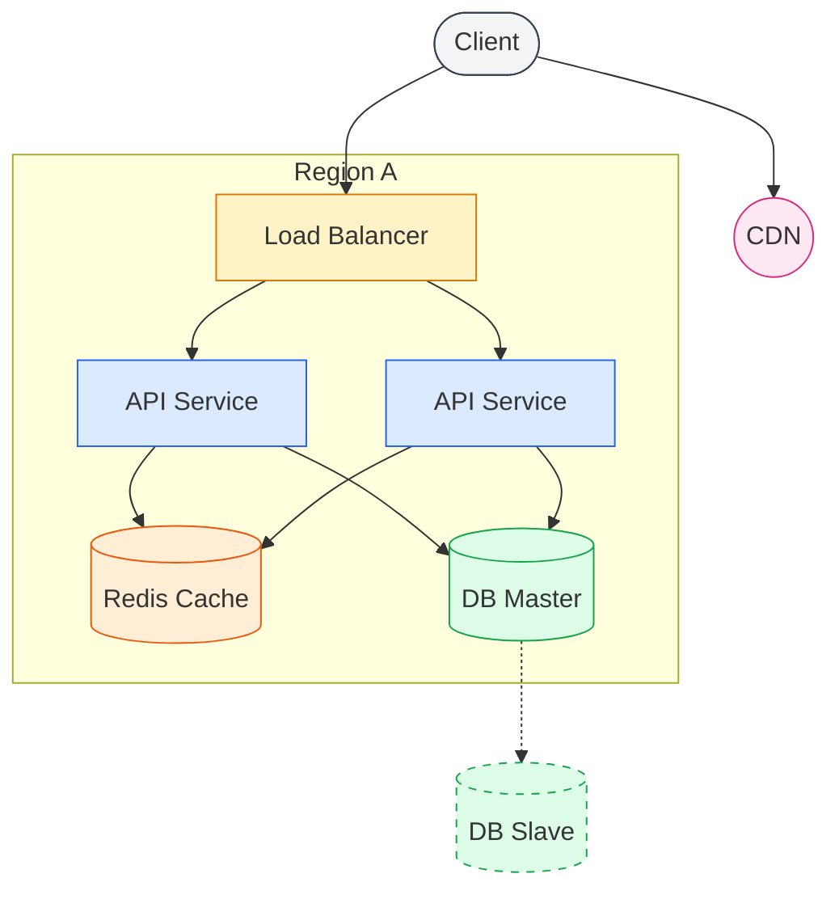

# The System Design Process

System design interviews can feel overwhelming because they are **open-ended**. There is no single "right" answer, and the path forward is rarely obvious.

The secret to success isn't memorizing every architecture; it's having a **reliable, repeatable process**. A mental roadmap that guides you through ambiguity, whether you're designing a URL shortener, a chat app, or a global video platform.

This guide introduces a battle-tested **5-Step Framework** that mirrors real-world engineering and aligns with what top interviewers look for.



---

## Step 1: Requirements & Scope
**"Measure twice, cut once."**

Before you draw a single box, you must define **what** you are building and **how** it needs to perform. Rushing this step is the most common failure mode.

### 1.1 Functional Requirements (The "What")
Define the core user-facing features. Keep it to the critical 3-5 features that define the MVP.

*   **Users:** Can they create, view, update, or delete content?
*   **System:** What automated steps must happen?

> [!TIP]
> **Example: URL Shortener**
> *   User inputs a long URL -> System returns a short URL.
> *   User visits short URL -> System redirects to long URL.
> *   System tracks click analytics.

### 1.2 Non-Functional Requirements (The "How")
This is where you show engineering maturity. Define the constraints that will shape your architecture.

*   **Scale:** 1k users or 1B users? (DAU/MAU)
*   **Latency:** Is 200ms okay, or do we need <50ms?
*   **Availability:** Can the system go down? (99.9% vs 99.999%)
*   **Consistency:** Do all users need to see the same data instantly? (Strong vs Eventual)

---

## Step 2: Data Model
**"Show me your flowcharts and conceal your tables, and I shall continue to be mystified. Show me your tables, and I won't usually need your flowcharts; they'll be obvious." — Fred Brooks**

Data is the gravity of your system. Define how it looks before moving it around.

### 2.1 Core Entities
List the nouns in your system and their attributes.



### 2.2 Access Patterns
How will this data be read and written? This decides your database.

*   **Read-Heavy?** Cache aggressively.
*   **Write-Heavy?** Queue-based ingestion, sharding.
*   **Complex Relations?** Relational DB (PostgreSQL).
*   **Unstructured/High-Volume?** NoSQL (Cassandra, DynamoDB).

---

## Step 3: API Design
**The Contract.**

Define how the outside world interacts with your black box. Use REST or gRPC style definitions.

### Define Endpoints

```http
// Create a short URL
POST /api/v1/urls
Request: {
  "longUrl": "https://very-long-website.com/resource",
  "customAlias": "optional-alias"
}
Response: {
  "shortUrl": "https://tiny.url/xyz123",
  "expiresAt": "2024-12-31T23:59:59Z"
}

// Get original URL (Redirect)
GET /api/v1/urls/{shortHash}
Response: 301 Redirect -> "https://very-long-website.com/resource"
```

> [!IMPORTANT]
> **Don't forget:** Authentication (Who are you?), Rate Limiting (429 Too Many Requests), and Error Handling (4xx/5xx).

---

## Step 4: High-Level Design (Pass 1)
**"Make it Work."**

Draw the "Happy Path". Connect the user to the data through the simplest possible infrastructure. Focus on correctness, not scale.

**Components:**
1.  **Client:** Web/Mobile.
2.  **Load Balancer:** Entry point.
3.  **Service:** Business logic.
4.  **Database:** Persistent storage.



---

## Step 5: High-Level Design (Pass 2)
**"Make it Scale."**

Now, break it. Ask "What happens if traffic increases 100x?" or "What if the DB fails?". Introduce advanced components to handle scale and reliability.

### 5.1 Scaling Strategies
*   **Caching:** Add Redis/Memcached for hot data.
*   **CDN:** Serve static assets (images, CSS) from the edge.
*   **Async Workers:** Offload heavy tasks (e.g., video processing) to a message queue (Kafka/SQS).
*   **Sharding:** Split the database by key.

### 5.2 Reliability
*   **Replication:** Master-Slave setup for DB.
*   **Redundancy:** Multiple service instances across Availability Zones (AZ).



---

# Summary

| Step | Goal | Key Question |
| :--- | :--- | :--- |
| **1. Requirements** | Define Scope | "What are we building and for whom?" |
| **2. Data Model** | Structure Data | "How is data stored and related?" |
| **3. API Design** | Define Contract | "How do clients talk to us?" |
| **4. HLD (Pass 1)** | Correctness | "Does it work for 1 user?" |
| **5. HLD (Pass 2)** | Scalability | "Does it work for 100M users?" |

Mastering this process turns chaos into structure. Practice applying this 5-step framework to every problem you encounter, and you will navigate system design interviews with confidence.
