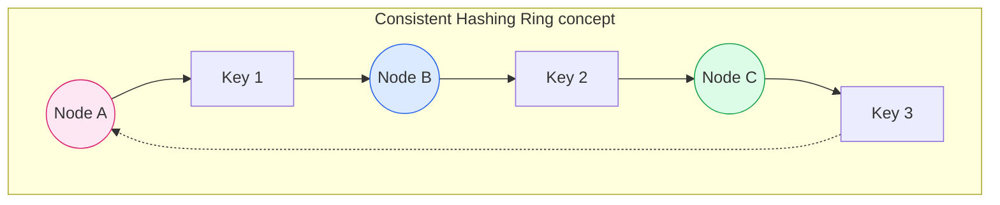

# Sharding

Sharding (or Horizontal Scaling) is the process of splitting a large dataset across multiple servers (shards). It is the eventual requirement for any system that grows beyond the limits of a single machine's write capacity or storage.

## 1. Choosing a Shard Key

The most critical decision in sharding is picking the **Shard Key**.
*   **High Cardinality**: The key must have many possible values. `Gender` is a bad key (only a few shards possible). `User_ID` is a good key.
*   **Even Distribution**: Data should spread evenly. A key like `Creation_Date` is bad because all new data goes to the same "today" shard.
*   **Aligns with Usage**: Shard by the field you query most. If you shard by `User_ID` but always query by `Email`, you'll hit every shard (Scatter-Gather).

## 2. Sharding Strategies

How do we decide which server holds which data?

### Range Based Sharding
Data is mapped based on a value range (e.g., `User_ID` 1-1000 on Shard A, 1001-2000 on Shard B).
*   **Pros**: Efficient for range queries (`SELECT * WHERE ID > 500`).
*   **Cons**: **Uneven Distribution**. If IDs are timestamps, all new writes hit the last shard (Hot Spot).

### Hash Based Sharding
Data is mapped using a hash function: `Shard_ID = hash(key) % Total_Shards`.
*   **Pros**: Even distribution of data.
*   **Cons**: **Resharding Pain**. Changing `Total_Shards` changes the modulo result for *almost every key*, forcing a massive data migration.
*   **Fix**: Use **Consistent Hashing**.

### Directory Based Sharding
A lookup service maintains a map of `Key -> Shard`.
*   **Pros**: Ultimate flexibility. You can move individual tenants to premium hardware.
*   **Cons**: **Single Point of Failure**. Every query must hit the lookup service first.

```mermaid
graph TD
    subgraph Range [Range Based]
    R_In[Key: 1500] --> R_Logic{1000 < Key < 2000?}
    R_Logic -- Yes --> S2[Shard B]
    end

    subgraph Hash [Hash Based]
    H_In[Key: 'Alicia'] --> H_Logic{hash('Alicia') % 3}
    H_Logic -- "Result: 0" --> S_A[Shard A]
    end

    subgraph Directory [Directory Based]
    D_In[Key: 'Tenant-X'] --> D_Map[Lookup Table]
    D_Map -- "Map: X -> Shard C" --> S_C[Shard C]
    end
    
    style Range fill:#f8fafc,stroke:#475569
    style R_Logic fill:#e0f2fe,stroke:#0284c7
    style S2 fill:#f0fdf4,stroke:#16a34a
    
    style Hash fill:#f8fafc,stroke:#475569
    style H_Logic fill:#fff7ed,stroke:#ea580c
    style S_A fill:#f0fdf4,stroke:#16a34a
    
    style Directory fill:#f8fafc,stroke:#475569
    style D_Map fill:#f3e8ff,stroke:#9333ea
    style S_C fill:#f0fdf4,stroke:#16a34a
```

---

## 3. Consistent Hashing

To solve the reshuffling problem of Hash Based sharding, we use a **Hash Ring**.
1.  Map both **Servers** and **Data Keys** to the same 0-360° circle.
2.  A Key is stored on the first Server found moving **clockwise**.
3.  **Scaling**: Adding a server only affects the keys in the gap before it.

### Virtual Nodes (The "Secret Sauce")
A common issue is that physical servers aren't evenly spaced, leading to "clumps" of data on one server.
*   **Solution**: **Virtual Nodes**. Each physical server (`Server A`) exists at multiple points on the ring (`A_1`, `A_2`, `A_3`).
*   **Result**: Even load distribution and smoother rebalancing.


```

---

## 4. Sharding Challenges

Sharding is complex. Only do it when you strictly need to.

### 🔥 Hot Spots (Celebrity Problem)
If `User_ID` is the shard key, and "Justin Bieber" has 100M followers, the shard holding his data will melt down.
*   **Solution 1: Compound Keys**. Shard by `(User_ID, Region)`.
*   **Solution 2: Isolated Shards**. Move high-traffic tenants to dedicated hardware to protect others.
*   **Solution 3: Dynamic Splitting**. Recursively split a hot shard into smaller sub-shards.

### 🧩 Cross-Shard Consistency
Transactions that span multiple shards (e.g., Transfer money from User A on Shard 1 to User B on Shard 2) are dangerous.
*   **Avoid**: Design your schema so transactions stay local (e.g., Shard by `Order_ID` so all line items are together).
*   **Result Caching**: Cache the results of expensive cross-shard joins to minimize frequency.
*   **Denormalization**: Duplicate necessary data across shards (e.g., store small User summary in Order shard) to avoid joins.
*   **Eventual Consistency**: Accept that data on different shards generally won't update instantly.
*   **Sagas Pattern**: If you *must* cross shards, do not use 2-Phase Commit (too slow). Use **Sagas**:
    1.  Execute local transaction on Shard 1.
    2.  Publish event.
    3.  Execute local transaction on Shard 2.
    4.  **Compensating Action**: If Step 3 fails, trigger an "Undo" transaction on Shard 1.
