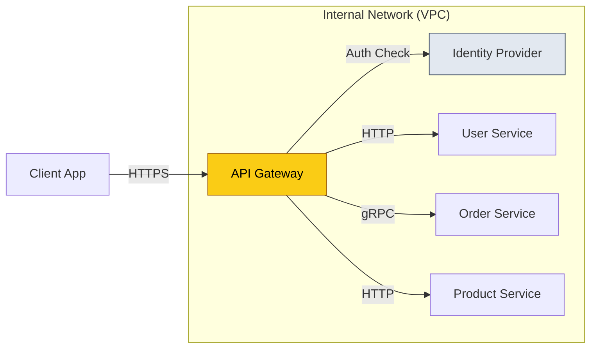
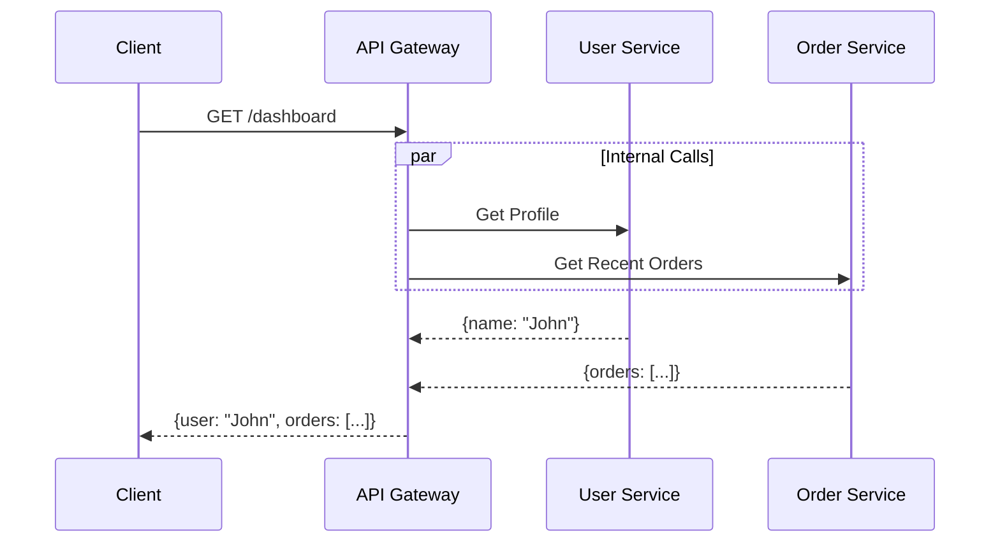

# API Gateway

In a microservices architecture, how do clients access dozens (or hundreds) of services? High latency, security risks, and tight coupling occur if clients talk directly to services. The **API Gateway** solves this by acting as a single entry point.

In System Design interviews, it is the answer to: "How do we handle Authentication?", "Rate Limiting?", "Protocol Translation?", and "Request Aggregation?".

## 1. Core Functions

It is effectively a **Reverse Proxy on Steroids**.

1.  **Routing**: Routes `/users` to User Service and `/orders` to Order Service.
2.  **Authentication & AuthZ**: Offloads security from microservices. Validates JWTs, checks scopes.
3.  **Rate Limiting**: Protects backend services from DDoS or noisy neighbors (Token Bucket algorithm).
4.  **Protocol Translation**: Converts external REST/HTTP calls to internal gRPC/Protobuf calls.
5.  **SSL Termination**: Decrypts HTTPS traffic so internal services can speak plain HTTP (faster).

---

## 2. Design Patterns

### Gateway Aggregation (Scatter-Gather)
A single client request (e.g., "Load Dashboard") requires data from 3 services. Instead of the client making 3 calls over the internet (High Latency), the Gateway makes 3 low-latency calls internally and joins them.

*   **Pros**: Reduces Round Trip Time (RTT).
*   **Cons**: Gateway becomes a monolith if too much logic is added.

### Backend for Frontend (BFF)
Instead of one "One Size Fits All" Gateway, create separate Gateways for specific client types.
*   **Mobile BFF**: Returns small JSON payloads (save data), optimized for iOS/Android.
*   **Web BFF**: Returns rich data for Desktop browsers.
*   **Public API Gateway**: Strict rate limits, standard REST docs for 3rd party devs.

---

## 3. Top Interview Topics

### Rate Limiting Algorithms
*   **Token Bucket**: Allow bursts. Tokens refill at constant rate.
*   **Leaky Bucket**: Smooths out traffic. Requests processed at constant rate.
*   **Fixed Window**: "100 reqs / min". Bug: Spikes at minute boundary.
*   **Sliding Window**: Smoother, prevents boundary spikes.

### Idempotency
Gateways can enforce idempotency keys (e.g., `UUIDv4` header).
1.  Client sends `POST /pay` with `Idempotency-Key: abc`.
2.  Gateway checks Redis. If `abc` exists, return cached response.
3.  If not, forward to Payment Service -> Save response to Redis.

### Circuit Breaking
Prevent cascading failures. If "Order Service" is down (500 errors > 50%):
1.  **Open Circuit**: Gateway immediately returns error (fail fast) instead of waiting for timeout.
2.  **Half-Open**: After X seconds, try 1 request. If success, Close Circuit.

---

## 4. Modern Implementations

*   **Nginx / HAProxy**: Classic, manual config, minimal logic.
*   **Kong / Tyk**: Open-source, plugin-based (Lua/Go), highly popular.
*   **AWS API Gateway**: Serverless, scales infinitely, expensive at scale.
*   **Spring Cloud Gateway**: Java-based, integrates well with Spring Boot microservices.
*   **Service Mesh (Istio/Envoy)**: "Sidecar" pattern for service-to-service calls (East-West traffic), while API Gateway handles External-to-Internal (North-South traffic).

---

## Summary Checklist
- [ ] **Cross-Cutting Concerns**: Auth, Logging, Rate Limiting (Offload connection management).
- [ ] **Patterns**: Aggregation vs. BFF.
- [ ] **Protocols**: REST vs. gRPC vs. GraphQL.
- [ ] **Resilience**: Circuit Breakers, Timeouts, Retries.
- [ ] **Failure Handling**: Fail fast (Circuit Breaker) vs. Fail silent (Partial Response).
