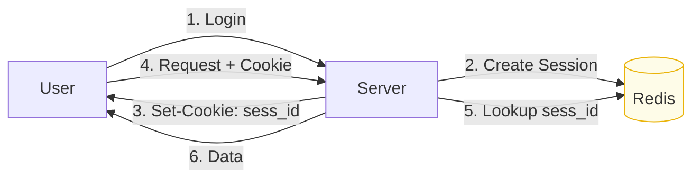
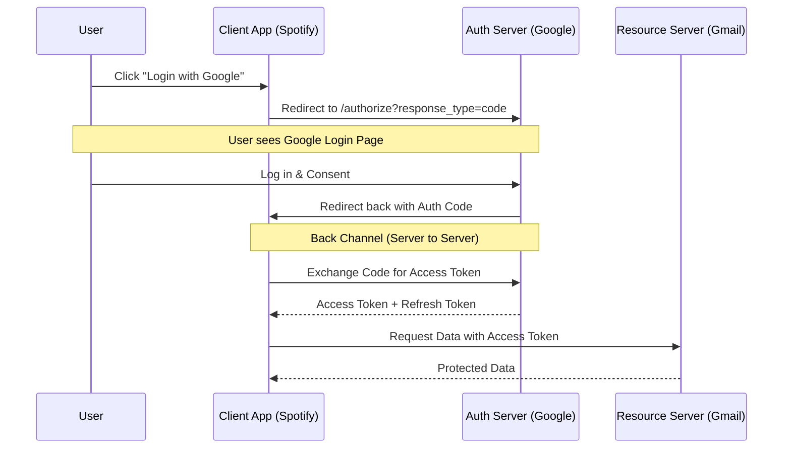
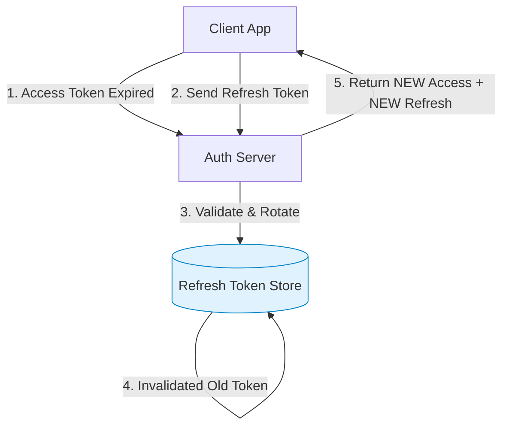

# Authorization & Authentication (Deep Dive)

Security is the backbone of any system. In system design interviews, confusing **Authentication (AuthN)** with **Authorization (AuthZ)** is a fatal red flag. This guide breaks down the mechanisms, protocols, and workflows you need to know to design secure systems.

## 1. Concepts: AuthN vs AuthZ

| Concept | Question | Description | Example |
| :--- | :--- | :--- | :--- |
| **Authentication (AuthN)** | **"Who are you?"** | Verifying the identity of a user or service. | Logging in with Username/Password, FaceID, API Key. |
| **Authorization (AuthZ)** | **"What can you do?"** | Determining permissions and access levels. | Admin can delete users; Viewer can only read posts. |

---

## 2. Authentication Mechanisms

There are two dominant ways to manage user state: **Server-Side Sessions** and **Client-Side Tokens**.

### A. Session-Based Authentication (Stateful)
This is the traditional method.
1.  User logs in.
2.  Server creates a `SessionID`, stores it in a Database (or Redis), and sends it to the browser as a `Set-Cookie` header.
3.  Browser sends the cookie automatically with every subsequent request.
4.  Server looks up `SessionID` in Redis to find the user.

*   **Pros**:
    *   **Instant Revocation**: If a user is banned or password changes, you just delete the session from Redis. Access stops immediately.
*   **Cons**:
    *   **Scalability**: Validating every request requires a network call to Redis. (Sticky Sessions are brittle).
    *   **CSRF**: Cookies are vulnerable to Cross-Site Request Forgery (need CSRF tokens).

### B. Token-Based Authentication (Stateless - JWT)
JSON Web Tokens (JWT) allow the client to store the state.
1.  User logs in.
2.  Server signs a JSON object `{"user_id": 123, "role": "admin"}` with a secret key.
3.  Server sends the **Signed JWT** to the Client.
4.  Client sends JWT in `Authorization: Bearer <token>` header.
5.  Server **verifies the signature** locally (CPU only). No Redis lookup needed!

*   **Pros**:
    *   **Scalability**: No database lookup for verification. Great for microservices.
    *   **Mobile Friendly**: Easier to use than cookies in native apps.
*   **Cons**:
    *   **Revocation is Hard**: You can't "delete" a JWT. It's valid until it expires.
    *   **Size**: JWTs are larger than simple Session IDs (bandwidth).

> [!WARNING]
> **The Revocation Problem**: How do you ban a user with a valid JWT?
> 1.  **Short Expiry**: Make Access Tokens valid for only 15 minutes.
> 2.  **Refresh Tokens**: Use a long-lived Refresh Token (stored in DB) to get new Access Tokens. To ban a user, revoke the Refresh Token. They lose access after 15 mins.

### C. API Keys
Used for Machine-to-Machine communication (e.g., Stripe API).
*   A long, random string sent in headers.
*   **Best Practice**: Hash them in the database (like passwords). Do not store plain text.

---

## 3. Protocols: OAuth 2.0 & OIDC

Do not roll your own crypto. Use standards.

### OAuth 2.0 (Authorization)
OAuth 2.0 is a protocol for **Delegated Authorization**. It lets a user give a third-party app access to their resources *without* sharing their password.
*   **Roles**:
    *   **Resource Owner**: You (the User).
    *   **Client**: The App (e.g., "Spotify").
    *   **Authorization Server**: The Gatekeeper (e.g., "Google Accounts").
    *   **Resource Server**: The API (e.g., "Gmail API").

### OpenID Connect (OIDC) (Authentication)
OAuth 2.0 alone is for *authorization*, but it was abused for *authentication* (Login with Facebook). **OIDC** fixes this by adding a strict identity layer on top of OAuth.
*   **ID Token**: A specific JWT format that contains user profile info.
*   **UserInfo Endpoint**: A standard API to fetch user details.

---

## 4. Workflows

### OAuth 2.0 Authorization Code Flow
This is the "Gold Standard" for web apps.

### Refresh Token Rotation
Keeping the user logged in securely.

---

## Summary Comparison

| Feature | Session (Cookie) | JWT (Token) |
| :--- | :--- | :--- |
| **State** | Server-Side (Redis/DB). | Client-Side (Self-contained). |
| **Revocation** | **Instant**. | **Delayed** (until expiry). |
| **Scalability** | Vertical is hard; Redis helps. | **Horizontal is easy**. |
| **Client** | Browsers only. | Web, Mobile, IoT, S2S. |
| **Security** | Vulnerable to CSRF. | Vulnerable to XSS (if stored in localStorage). |

### Recommendations
1.  **Monolithic Web App**: Use **Sessions**. Simple, secure, instant revocation.
2.  **Microservices / Mobile App**: Use **JWT + Refresh Tokens**. Scales well, works everywhere.
3.  **Public API**: Use **OAuth 2.0**.
