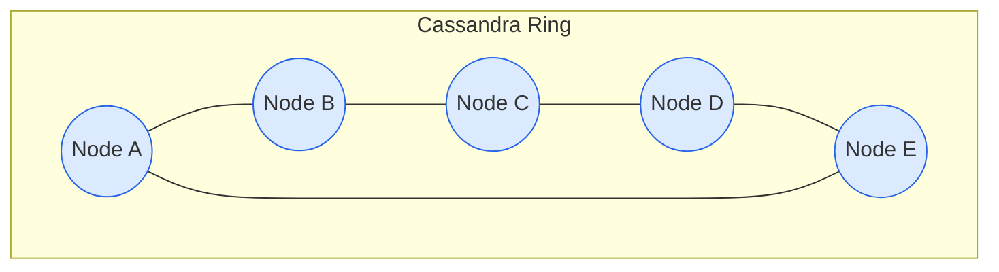
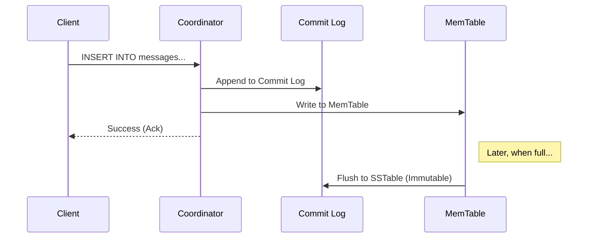

# Cassandra

Apache Cassandra is a distributed **NoSQL** database designed to handle massive amounts of data across many commodity servers without a single point of failure. It is a **wide-column store** that excels at **high write throughput** and linear scalability.

In System Design interviews, Cassandra is the standard answer for "How do we store billions of writes per day?" (e.g., Discord messages, Uber location history, Netflix viewing history).

---

## 1. Core Architecture: Masterless & The Ring

Unlike master-slave architectures (MySQL replication, Redis Sentinel), Cassandra is **Masterless** (Peer-to-Peer). Every node is identical.

### The Token Ring (Consistent Hashing)
Nodes are arranged in a ring.
*   **Token Range**: Each node is responsible for a specific range of integers (tokens).
*   **Partition Key**: Data is distributed based on `Hash(PartitionKey)`.
*   **Virtual Nodes (VNodes)**: Instead of one big range per node, each physical node holds many small, non-contiguous ranges (VNodes). This improves load balancing and rebuild times.



### Gossip Protocol
How do nodes know who is alive? They gossip.
*   Every second, a node talks to up to 3 other nodes.
*   They exchange state information (load, uptime, token ranges).
*   **Phi Accrual Failure Detector**: Instead of a binary "up/down", it calculates a *probability* that a node is down based on heartbeat intervals.

---

## 2. Internals: The Write Path

Cassandra is optimized for writes. It treats random writes as **sequential appends**.

1.  **Commit Log (Disk)**: The write is appended to the Commit Log on disk for durability (crash recovery).
2.  **MemTable (RAM)**: The write is added to an in-memory structure called the MemTable (Sorted Map).
3.  *Ack*: The node acknowledges the write implies success.
4.  **Flush**: When the MemTable is full, it is flushed to disk as an **SSTable**.
5.  **SSTable (Sorted String Table)**: Immutable data file on disk.



> [!TIP]
> **Why is it so fast?** No disk seeks! It just appends to the log. Index updates happen in memory (MemTable).

---

## 3. Internals: The Read Path

Reads are more complex because data might be fragmented across many SSTables (due to updates/overwrites).

1.  **Bloom Filter**: Rapidly checks if an SSTable *might* contain the partition key. (False positives possible, false negatives impossible).
2.  **Key Cache**: Checks in-memory cache for the key's location.
3.  **MemTable**: Checks for recent in-memory writes.
4.  **SSTables**: If not in MemTable, it scans the relevant SSTables on disk.
5.  **Merge**: It merges data from MemTable and multiple SSTables. The version with the **latest timestamp** wins (Last-Write-Wins).

### Compaction
Since SSTables are immutable, updates are actually new writes. Deletes are writes of a **Tombstone**.
*   **Compaction Process**: Background process merges small SSTables into larger ones, discarding obsolete data (overwritten values) and Tombstones (deleted data).

---

## 4. Data Model

Query-First Design: In SQL, you model data first. In Cassandra, you **model queries first**.

*   **Keyspace**: Like a database (contains tables).
*   **Table (Column Family)**: Collection of rows.
*   **Partition Key**: Determines **which node** data lives on.
*   **Clustering Key**: Determines **sorting order** within that node.

**Example: Discord Messages**
```sql
CREATE TABLE channel_messages (
    channel_id uuid,          -- Partition Key (Groups messages by channel)
    created_at timestamp,     -- Clustering Key (Sorts by time)
    message_id uuid,
    content text,
    PRIMARY KEY ((channel_id), created_at)
) WITH CLUSTERING ORDER BY (created_at DESC);
```
*   This ensures getting the "last 50 messages for channel X" is a fast, sequential disk read on one node.

---

## 5. Tunable Consistency (CAP Theorem)

Cassandra is an **AP** system (Availability + Partition Tolerance). You tune consistency per query.

*   `CL=ONE`: Fire and forget. Fast, low consistency.
*   `CL=QUORUM`: Majority of replicas must acknowledge. `(R/2) + 1`. Stronger consistency.
*   `CL=ALL`: All replicas must ack. Highest consistency, lowest availability.

> [!IMPORTANT]
> **Strong Consistency Formula**: `Read_CL + Write_CL > Replication_Factor`.
> Typically: Write Quorum + Read Quorum > RF.

### Hinted Handoff
If a replica is down during a write, the coordinator stores a "hint". When the replica comes back, the coordinator replays the missed write.

### Read Repair
During a read, if the coordinator notices replicas have different data (inconsistent), it returns the latest version to the client and asynchronously updates the stale replicas.

---

## Summary Checklist
- [ ] **LSM Tree**: Log-Structured Merge Tree (MemTable -> SSTable).
- [ ] **Masterless**: Peer-to-peer ring, no single point of failure.
- [ ] **Tunable Consistency**: Trade latency for accuracy.
- [ ] **Tombstones**: Deletes are just special writes.
- [ ] **Wide-Column**: Flexible schema, optimized for specific queries.
