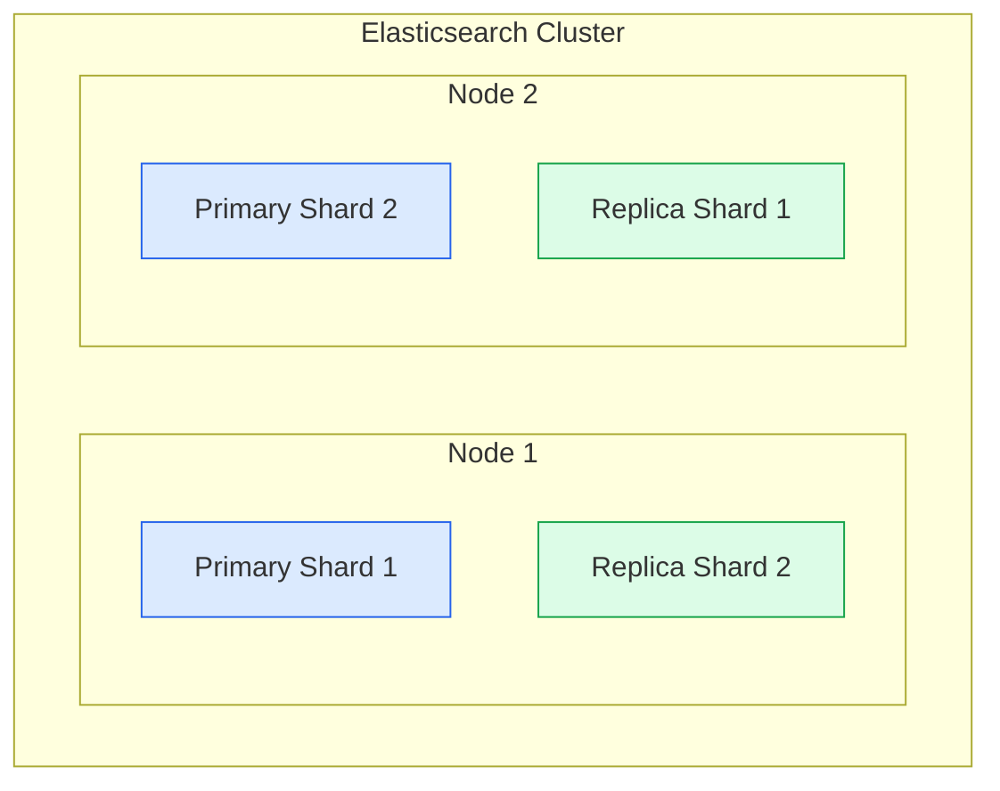
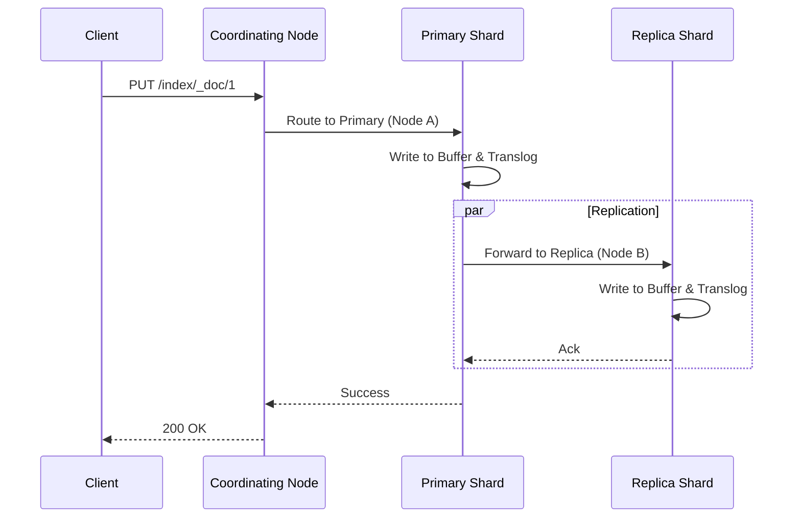

# Elasticsearch

Elasticsearch is a distributed, RESTful search and analytics engine built on top of **Apache Lucene**. While Redis is optimized for key-value speed, Elasticsearch is optimized for **search** (finding data closely matching a query) and **analytics** (aggregating massive datasets). in System Design, it is the standard answer for "How do we search this?", "Log analytics", or "Autocomplete".

## 1. Core Concepts & Architecture

At its heart, Elasticsearch is a distributed abstraction over Lucene.

### Logical vs. Physical Layout

*   **Index (Logical)**: A collection of documents (like a *Table* in SQL).
*   **Document**: A JSON object (like a *Row*).
*   **Shard (Physical)**: An index is split into horizontal partitions called **Shards**. Each shard is a **fully functional Lucene Index**.
*   **Replica**: A copy of a primary shard for High Availability (HA) and Read Scaling.

### The Inverted Index
This is the magic data structure that makes full-text search fast. Instead of storing `Doc -> Words` (like a DB), it stores `Word -> Docs`.

**Example:**
*   Doc 1: "To be or not to be"
*   Doc 2: "To be is the question"

**Inverted Index:**
| Term | Doc IDs | Frequency |
| :--- | :--- | :--- |
| `to` | [1, 2] | 3 |
| `be` | [1, 2] | 3 |
| `or` | [1] | 1 |
| `not` | [1] | 1 |
| `is` | [2] | 1 |

> [!NOTE]
> Values are immutable. Once a document is written to a Lucene segment (a set of inverted indexes), it cannot be changed. Updates are actually `DELETE` + `INSERT`.

---

## 2. Distributed Internal Working

Understanding the **Write** and **Read** paths is critical for deep dive interviews.

### The Write Path (Indexing)
Elasticsearch ensures data durability and near real-time (NRT) search.

1.  **Coordinating Node**: Client sends request -> Coordinating node hashes ID (`shard = hash(id) % num_shards`) and forwards to **Primary Shard**.
2.  **Primary Shard**: Validates and writes locally.
3.  **Parallel Replication**: Forwards to all **Replica Shards** in parallel.
4.  **Ack**: Once Primary + Replicas confirm, success is returned.

**What happens inside the Shard?**
1.  **Memory Buffer**: Doc is written to a memory buffer.
2.  **Translog**: Doc is appended to the **Transaction Log** (for durability).
3.  **Refresh (Every 1s)**:
    *   Buffer is written to a new **Lucene Segment** on disk (in-memory cache of OS).
    *   *Now searchable!* This is why it's "Near Real-Time".
4.  **Flush**:
    *   Translog grows too big -> Trigger Flush.
    *   Segments are `fsync`ed to physical disk.
    *   Translog is cleared.

### The Read Path (Search)
Search is a two-phase process: **Query** then **Fetch**.

#### Phase 1: Query (Scatter)
1.  **Scatter**: Coordinating node sends the query to a copy (Primary or Replica) of **every shard** in the index.
2.  **Local Execute**: Each shard executes the query locally against its Lucene segments and generates a priority queue of results (e.g., Top 10 by score).
3.  **Return IDs**: Shards return *only* the Doc IDs and Scores to the Coordinating Node (not the full JSON).

#### Phase 2: Fetch (Gather)
1.  **Merge**: Coordinating node merges all sorted lists to find the global Top 10.
2.  **Fetch**: It requests the actual JSON documents (`_source`) from the specific shards holding those docs.
3.  **Return**: Returns full response to client.

> [!WARNING]
> **Deep Pagination Problem**: Requesting "Page 10,000" requires every shard to fetch 100,000 docs, sort them, and return. This kills performance. Use `search_after` (cursor-based) for deep pagination.

---

## 3. Node Roles & Split Brain

In a cluster, not all nodes are equal.
*   **Master Node**: Lightweight. Managers cluster state (add/remove index, track nodes).
*   **Data Node**: Heavy. Stores data, runs Lucene queries (CPU/RAM intensive).
*   **Coordinating Node**: Smart Router. Handles client REST requests, scatters/gathers (RAM intensive).

### Split Brain
If the network partitions, two nodes might both think they are Master.
*   **Solution**: **Quorum** (`discovery.zen.minimum_master_nodes`). You need `(N/2) + 1` nodes to elect a master.
*   *Modern ES (7+)* handles this automatically with a Raft-like consensus.

---

## 4. System Design Use Cases

### 1. Log Analytics (ELK Stack)
*   **Ingest**: Application logs -> Kafka -> Logstash/Fluentd -> Elasticsearch.
*   **Storage**: Time-series indices (`logs-2023-01-01`, `logs-2023-01-02`).
*   **Optimization**:
    *   **Hot/Warm Architecture**: Recent logs on SSD (Hot), old logs on HDD (Warm).
    *   **Rollover**: Create new index when size hits 50GB.

### 2. E-Commerce Search (Fuzzy / Autocomplete)
*   **Fuzzy Search**: Handle typos ("ipone" -> "iphone"). Uses **Levenshtein Distance**.
*   **N-Grams**: Break words into chunks for partial matching ("Apple" -> "Ap", "App", "Appl"). Used for **Autocomplete**.

---

## Summary Checklist
- [ ] **Data Model**: Documents, Indices, Shards, Replicas.
- [ ] **Architecture**: Lucene Segments (Immutable), Inverted Index.
- [ ] **Write Path**: Translog (Durability) vs. Refresh (Visibility).
- [ ] **Read Path**: Query-Then-Fetch (Scatter/Gather).
- [ ] **Optimizations**: `search_after` for pagination, Hot/Warm architecture.
