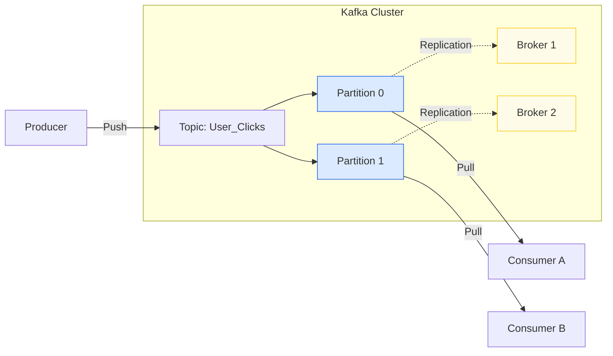
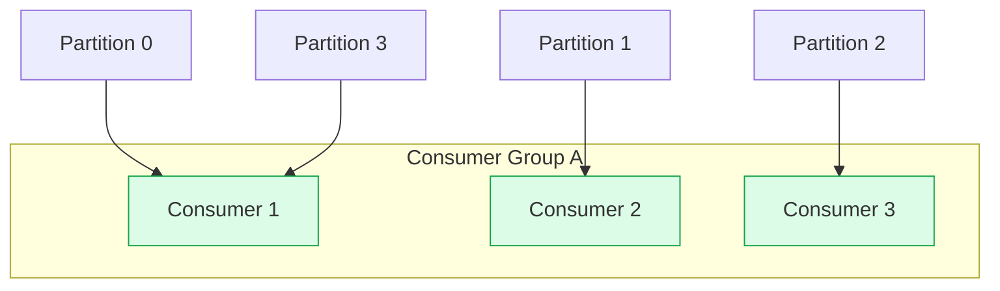

# Kafka Deep Dive

Apache Kafka is a distributed **Event Streaming Platform**. It is different from traditional message queues (like RabbitMQ) because it is designed to be **durable**, **fast**, and **scalable**. In System Design, use Kafka for: **High Throughput**, **Log Aggregation**, **Event Sourcing**, and **Stream Processing**.

## 1. Core Architecture

Kafka is a **Distributed Commit Log**. It is not just a queue; it is a storage system that persists data for a set retention period.

*   **Producer**: Pushes messages to a Topic.
*   **Topic**: A logical category of messages (e.g., "user-clicks").
*   **Partition**: A topic is split into **Partitions** for scalability. A partition is an **ordered, immutable sequence of records**.
*   **Consumer**: Pulls messages from a Topic.
*   **Broker**: A Kafka server.

### The Log Anatomy (Physical Storage)
How does Kafka achieve such high throughput? **Sequential I/O**.

*   **Segment**: Partitions are split into **Segments** (files on disk, e.g., `0000.log`, `0000.index`).
*   **Append Only**: Writes always go to the end of the latest segment. This avoids slow random disk seeks.
*   **Zero Copy**: Kafka uses `sendfile()` system call to transfer data from disk to network without copying it into application memory (Kernel to Kernel).

---

## 2. Partitions & Consumer Groups

This is the most critical concept for scaling.

### Partitioning
*   **Scalability**: Partitions allow a topic to be spread across multiple servers.
*   **Ordering**: Order is **ONLY guaranteed within a Partition**, not across the entire Topic.
*   **Hashing**: `Partition = hash(Key) % NumPartitions`. If Key is null, it's Round Robin.

### Consumer Groups
*   **Parallelism**: A Consumer Group reads from a topic together.
*   **Rule**: **One Partition can only be consumed by ONE Consumer per Group**.
    *   If you have 10 Partitions and 2 Consumers, each gets 5.
    *   If you have 10 Partitions and 20 Consumers, **10 Consumers stay idle**.

### Rebalancing
When a consumer joins or dies, Kafka redistributes partitions.
*   **Stop-the-World**: Traditionally, consumption stops during rebalancing.
*   **Static Membership** (KIP-345): Consumers persist their `group.instance.id`. If they restart quickly (within session timeout), no rebalance triggers.

---

## 3. Durability & Reliability

How do we prevent data loss?

### Replication
*   **Leader**: Handles ALL Reads and Writes for a partition.
*   **Follower**: Passively replicates data from the Leader.
*   **ISR (In-Sync Replica)**: A follower that is "caught up" with the leader. Only ISRs are eligible to become new leaders.

### Producer Acks
*   `acks=0`: Fire and forget. Fastest, highest risk.
*   `acks=1`: Leader acknowledges. Safe if Leader doesn't crash immediately.
*   `acks=all`: Leader + ALL ISRs acknowledge. Slowest, zero data loss.

### min.insync.replicas
This is a broker/topic config, NOT a producer config.
*   If `acks=all` and `min.insync.replicas=2`, write fails if only 1 replica is alive.
*   **Rule of Thumb**: `Replication Factor = 3`, `min.insync.replicas = 2`, `acks = all`. Allows 1 node failure with no data loss.

---

## 4. System Design Use Cases

### 1. CDC (Change Data Capture)
*   **Scenario**: Sync valid user database to a search engine (Elasticsearch).
*   **Tool**: **Debezium** (Kafka Connect) reads MySQL binlog -> pushes "Row Inserted" events to Kafka.
*   **Consumer**: Elasticsearch sink connector reads Kafka -> indexes user.

### 2. Event Sourcing
*   **Concept**: Store *state changes* (events) rather than current state.
*   **Kafka**: The "Source of Truth". You can replay the entire history of events to rebuild the state or fix a bug in a downstream consumer.

### 3. Log Aggregation
*   **Scenario**: Collect logs from 500 microservices.
*   **Flow**: Filebeat -> Kafka -> Logstash -> Elasticsearch. Kafka acts as a **buffer** during traffic spikes (Backpressure).

---

## Summary Checklist
- [ ] **Log & Segments**: Sequential I/O, Append-only.
- [ ] **Partitions**: Unit of parallelism and ordering.
- [ ] **Consumer Groups**: Load balancing, 1-to-1 mapping with partitions.
- [ ] **Replication**: Leader/Follower, ISR.
- [ ] **Durability settings**: `acks=all`, `min.insync.replicas`.
- [ ] **Zero Copy**: Optimization for network transfer.
