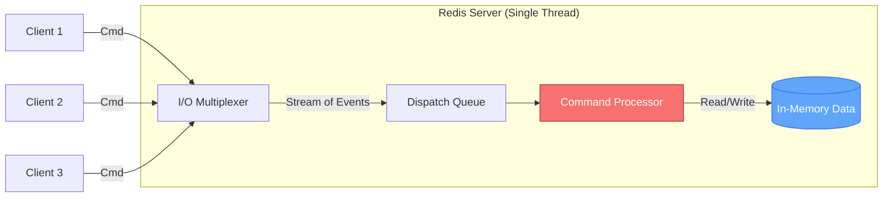
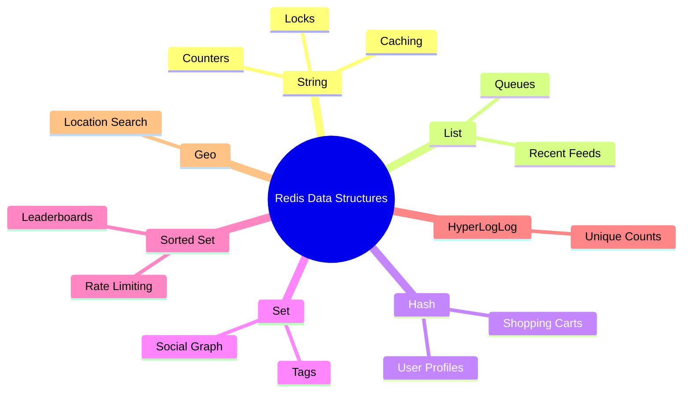
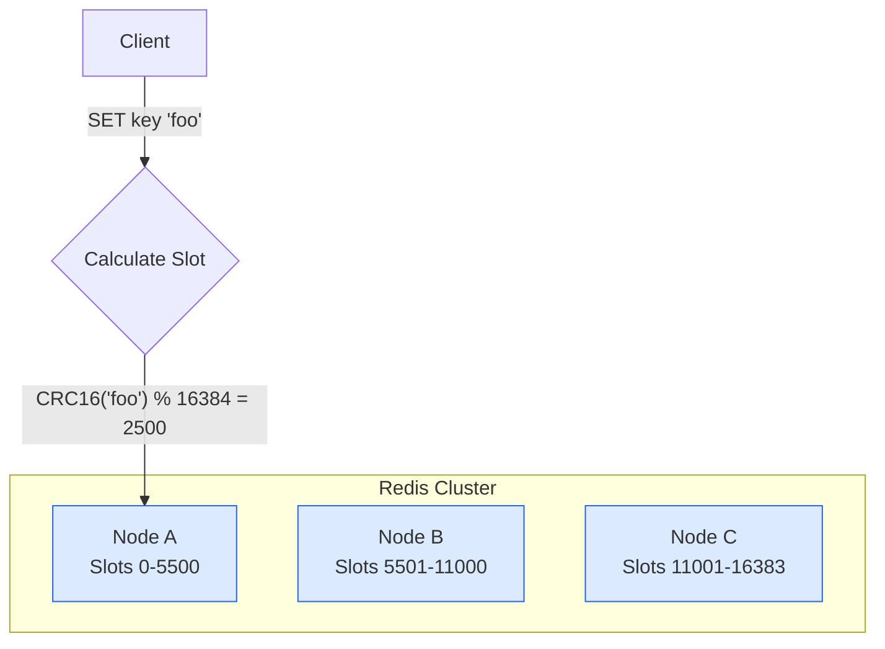

# Redis Deep Dive

Redis (Remote Dictionary Server) is an **in-memory**, **single-threaded** key-value store known for its sub-millisecond latency. In System Design interviews, it is the de-facto solution for caching, but its capabilities extend far beyond simple key-value storage. It acts as a Swiss Army knife for distributed systems—powering leaderboards, rate limiters, queues, and real-time analytics.

## 1. Core Architecture

### Why Single-Threaded?
Redis uses a **single-threaded event loop** to handle client requests. This might sound like a bottleneck, but it is a feature:
*   **CPU is rarely the bottleneck**: Request handling is usually limited by Memory or Network.
*   **No Locks**: Single-threading eliminates the complexity and overhead of locks, preventing race conditions on data structures.
*   **No Context Switching**: Avoids the CPU cost of switching between threads.

It uses **I/O Multiplexing** (epoll/kqueue) to handle thousands of concurrent connections efficiently.

> [!NOTE]
> While the main request processing is single-threaded, newer versions of Redis (6.0+) use **I/O threads** to handle network reading/writing in parallel, further improving throughput while keeping the data access logic single-threaded and lock-free.

### Persistence
Since Redis is in-memory, a server restart wipes all data. To prevent this, Redis offers two persistence models:

| Feature | RDB (Snapshot) | AOF (Append Only File) |
| :--- | :--- | :--- |
| **Mechanism** | Takes full snapshots of the dataset at intervals (e.g., every 5 mins). | Logs every write operation received by the server. |
| **Recovery Speed** | **Fast**. Compact binary file, quick to load into memory. | **Slow**. Must replay every command to reconstruct state. |
| **Data Safety** | **Lower**. You lose data since the last snapshot (e.g., last 5 mins). | **High**. Default `fsync` every 1s means at most 1s data loss. |
| **File Size** | Compact (Compressed). | Large (Contains all operation history). |

> [!TIP]
> **Production Best Practice**: Enable **Hybrid Persistence** (Redis 4.0+). The AOF file starts with an RDB snapshot (for fast boot) and appends commands (for durability).

---

## 2. Data Structures & System Design Use Cases

The most common mistake in interviews is using Redis only for `set(key, value)`. Knowing the *right* data structure for the *right* problem is what sets senior engineers apart.

### 1. String
Binary-safe strings up to 512MB.
*   **Usage**: `SET`, `GET`, `INCR`, `DECR`, `SETNX` (Set if Not Exists).
*   **Design Pattern**:
    *   **Caching**: Storing serialized JSON objects.
    *   **Counters**: Page views, video likes (`INCR video:123:likes`).
    *   **Distributed Locks**: `SET resource_lock "uuid" NX PX 10000` (Atomicity).

### 2. List
Doubly-linked lists. Fast writes to head/tail ($O(1)$).
*   **Usage**: `LPUSH`, `RPOP`, `LRANGE`.
*   **Design Pattern**:
    *   **Activity Feeds**: Store the user's latest 50 updates.
    *   **Message Queues**: Producer pushes to left, Consumer pops from right (Simple Job Queue).

### 3. Hash
Map of fields to values. Optimized for memory.
*   **Usage**: `HSET`, `HGET`, `HGETALL`.
*   **Design Pattern**:
    *   **Partial Object Caching**: Store a User Profile object. You can update just the `last_login` field without reading/writing the entire user object.

### 4. Set
Unordered collection of unique strings.
*   **Usage**: `SADD`, `SISMEMBER`, `SINTER`.
*   **Design Pattern**:
    *   **Tags**: Store tags for a blog post.
    *   **Common Friends**: `SINTER(user:A:friends, user:B:friends)` finds the intersection effectively.
    *   **Unique Visitors**: Track IPs visiting a site (if exact count needed).

### 5. Sorted Set (ZSet)
Unique strings ordered by a floating-point **score**.
*   **Usage**: `ZADD`, `ZRANGE`, `ZRANK`.
*   **Design Pattern**:
    *   **Leaderboards**: Score = Points. `ZRANGE` gives top players efficiently.
    *   **Priority Queues**: Score = Priority level.
    *   **Rate Limiter**: Score = Timestamp. Count requests in a sliding window.

### 6. HyperLogLog
Probabilistic data structure for cardinality (count unique items).
*   **Usage**: `PFADD`, `PFCOUNT`.
*   **Design Pattern**:
    *   **Massive Scale Functions**: Count unique visitors to google.com. Uses fixed 12KB memory for 0.81% error rate, vs GBs for a Set.

### 7. Geo
Geospatial index (uses ZSets under the hood with Geohash).
*   **Usage**: `GEOADD`, `GEORADIUS`.
*   **Design Pattern**:
    *   **Proximity Search**: "Find Uber drivers within 5km".

---

## 3. Distributed Redis (Scaling)

How to use Redis when data exceeds RAM or throughput exceeds one server?

### Replication (Master-Slave)
*   **Master**: Handles all **Write** operations. Can also handle Reads.
*   **Replica (Slave)**: Replicates data from Master asynchronously. Handles **Read** operations (Read Scaling).
*   **Issue**: If Master fails, manual intervention is needed (unless Sentinel is used).

### Redis Sentinel (High Availability)
Sentinel is a monitoring system that runs alongside Redis.
1.  **Monitors**: Checks if Master is alive.
2.  **Notification**: Alerts admins/apps.
3.  **Automatic Failover**: If Master dies, it promotes a Replica to be the new Master.

### Redis Cluster (Horizontal Scaling)
Used when dataset is too large for one server's RAM.
*   **Sharding**: Data is automatically split across multiple nodes.
*   **Hash Slots**: Redis doesn't use Consistent Hashing directly. It uses **16,384 Hash Slots**.
    *   `Hash Slot = CRC16(key) % 16384`
    *   Every node is responsible for a subset of hash slots.
*   **Shared Nothing**: Nodes talk to each other (gossip protocol) but don't share data.

---

## 4. Advanced Interview Topics

### Eviction Policies (Memory Management)
When `maxmemory` is reached, what does Redis do?
*   **allkeys-lru**: Evict Least Recently Used key (Most common for caching).
*   **allkeys-lfu**: Evict Least Frequently Used key.
*   **volatile-lru**: Evict LRU key *only if it has a TTL*.
*   **noeviction**: Return error on write (Default).

### Distributed Locking with Redlock
Using a single instance for locking is dangerous (what if it crashes?). **Redlock** algorithm:
1.  Client acquires lock from N (e.g., 5) independent Redis masters.
2.  Lock is acquired if it succeeds on Majority (N/2 + 1) instances.
3.  Valid for a limited time (TTL).

### Cache Stampede (Thundering Herd)
When a hot key expires, thousands of concurrent requests might hit the DB.
*   **Solution**: **Probabilistic Early Recomputation**.
*   If `TTL < random_time_window`, recompute the cache *before* it actually expires.

---

## Summary Checklist
- [ ] Understand **Data Structures** (String, List, Hash, Set, ZSet).
- [ ] Understand **Persistence** (RDB vs. AOF).
- [ ] Understand **Eviction Policies** (LRU vs. LFU).
- [ ] Be able to design **Leaderboards** (ZSet) and **Rate Limiters** (ZSet/Counters).
