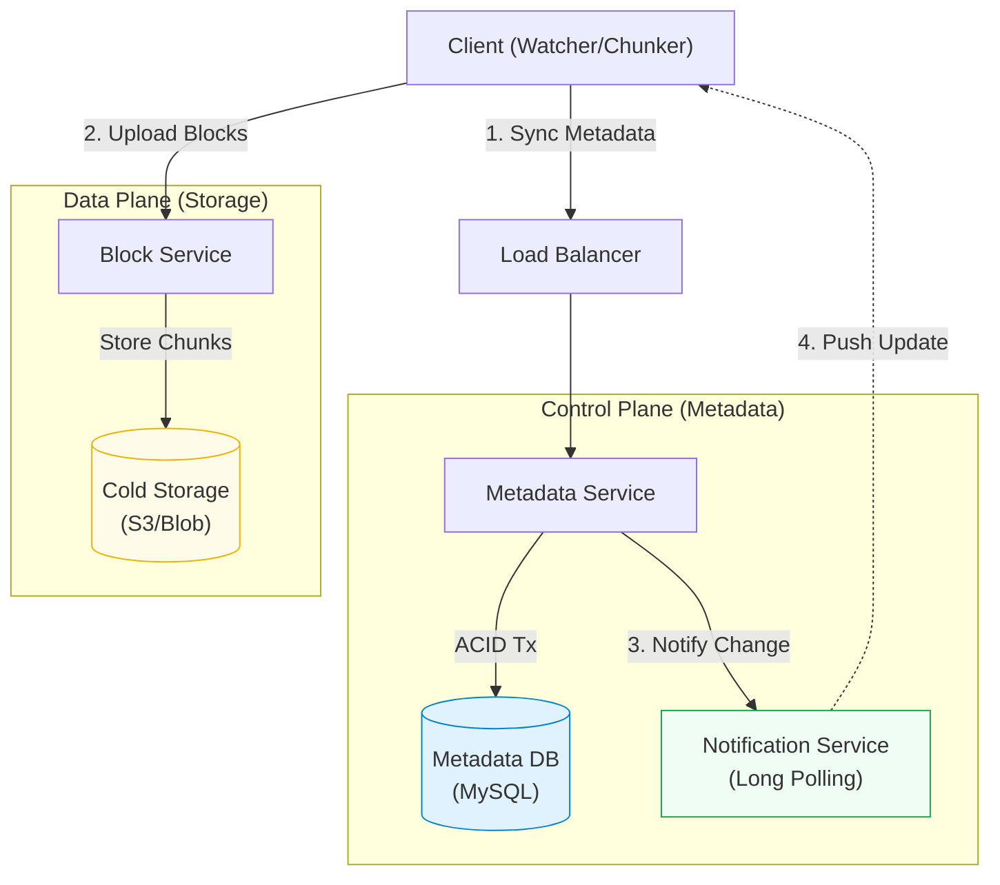

# Designing a File Sync Service (Dropbox / Google Drive)

Design a file hosting service like Dropbox or Google Drive. Users can store files in the cloud, synchronize them across multiple devices, and share them with others. This problem tests your knowledge of **strong consistency**, **chunked uploads**, and **synchronization protocols**.

## 1. Functional Requirements

*   **Add/Update/Delete Files**: Users can upload files, edit them, or delete them.
*   **Sync**: Changes made on one device (e.g., Laptop) should automatically reflect on other devices (e.g., Mobile).
*   **Versioning**: Keep a history of file changes so users can restore previous versions.
*   **Offline Support**: Users can edit files offline; changes sync when back online.
*   **Large Files**: Support for massive files (GBs in size).

## 2. Non-Functional Requirements

*   **High Reliability & Durability**: Data loss is unacceptable. We need 99.999999999% durability (11 nines).
*   **Strong Consistency**: All devices must see the same file structure. Eventual consistency can lead to confusing conflicts.
*   **Synchronization Latency**: Sync speed should be fast, but we prioritize consistency and correctness.
*   **Bandwidth Efficiency**: Don't re-upload the entire 1GB file if only 1KB changed.

---

## 3. Core Entities / Schema

We need to separate **Metadata** (file names, hierarchy, permissions) from **Block Data** (actual file content).

### Metadata Database (Relational - MySQL/Postgres)
We need ACID transactions to ensure file system integrity.

**`Users` Table**
| Column | Type | Description |
| :--- | :--- | :--- |
| `user_id` | `UUID` | PK. |
| `email` | `VARCHAR` | |

**`Files` Table** (Represents the file hierarchy)
| Column | Type | Description |
| :--- | :--- | :--- |
| `file_id` | `UUID` | PK. |
| `user_id` | `UUID` | Owner. |
| `parent_id` | `UUID` | Pointer to folder (Adjacency List). |
| `name` | `VARCHAR` | Filename. |
| `is_folder` | `BOOLEAN` | True if folder. |
| `version` | `INT` | Version number (v1, v2...). |
| `latest_checksum` | `VARCHAR` | Hash of the file content. |

**`BlockMetadata` Table** (Mapping Files to Chunks)
| Column | Type | Description |
| :--- | :--- | :--- |
| `file_id` | `UUID` | FK to Files. |
| `version` | `INT` | Which version this block belongs to. |
| `block_order` | `INT` | Sequence (1st block, 2nd block...). |
| `block_hash` | `CHAR(64)` | SHA-256 hash of the block content. |

### Block Storage (S3 / Blob Store)
Stores the actual immutable chunks of data identified by their hash. If two users upload the same file (same hash), we only store one copy (**Deduplication**).

---

## 4. API Design

### Upload File
`POST /api/v1/files/upload`
*   Initializes an upload session.
*   Client uploads individual blocks to Block Server.
*   Once all blocks are done, Client calls `commit` to update Metadata.

### Download File
`GET /api/v1/files/:file_id`
*   Returns metadata and a list of block URLs to download.

### Get Changes (Delta Sync)
`POST /api/v1/files/sync`
*   **Input**: `latest_cursor` (Last time the client synced).
*   **Output**: List of file changes since that cursor.

---

## 5. High-Level Design

The architecture is split into the **Control Plane** (Metadata) and **Data Plane** (Block Storage).

### Architecture Diagram

### Component Breakdown
1.  **Client**:
    *   **Watcher**: Monitors local file system for changes.
    *   **Chunker**: Splits large files into smaller chunks (e.g., 4MB). Computes SHA-256 hash.
    *   **Indexer**: Maintains local state.
2.  **Block Service**:
    *   Receives raw blocks. Checks if `block_hash` already exists in S3 (Deduplication). If yes, skip upload.
3.  **Metadata Service**:
    *   Orchestrates file updates. Updates the `Files` table only after blocks are successfully stored.
4.  **Notification Service**:
    *   Uses **Long Polling** or **WebSockets** to alert connected clients that a file has changed, triggering them to pull updates.

---

## 6. Deep Dives

### A. Chunking & Deduplication
Why split files?
*   **Resumable Uploads**: If a 1GB upload fails at 99%, we only retry the last 4MB chunk.
*   **Bandwidth Efficiency**: If you change 1 word in a 100-page doc, only the chunk containing that word changes. We only upload *that* chunk.
*   **Deduplication**: By using Content-Addressable Storage (CAS) where `key = hash(content)`, we store identical blocks only once.
    *   *Example*: 100 employees upload `Benefit_Policy_2024.pdf`. We store only 1 copy in S3, but update 100 metadata records to point to it. massive storage savings.

### B. Synchronization Logic
How do clients stay in sync?
1.  **Client A** updates `doc.txt`.
2.  Client A uploads new blocks -> commits to Metadata Server.
3.  Metadata Server updates `version` from v1 to v2.
4.  Notification Service sends invalidation signal to **Client B**.
5.  Client B calls `/sync`, sees `doc.txt` is now v2.
6.  Client B downloads only the *changed* chunks and reconstructs the file.

### C. Strong Consistency vs. Eventual Consistency
For file storage, users expect **Strong Consistency**. If I save a file on my laptop and immediately open it on my phone, I expect the *latest* version.
*   We use a **Relational Database** (ACID) for metadata to ensure file hierarchy and versions are strictly ordered.
*   We do NOT use Eventual Consistency (like Cassandra) for the core metadata, though it could be used for analytics or logs.

---

## Summary Checklist

- [ ] **Chunking**: Break files into 4MB chunks for delta sync.
- [ ] **Deduplication**: Hash blocks to save space.
- [ ] **Metadata**: Separate from block storage; use SQL for consistency.
- [ ] **Sync**: Use Long Polling to notify clients of changes.
- [ ] **Reliability**: Checksums at every stage to prevent data corruption.
