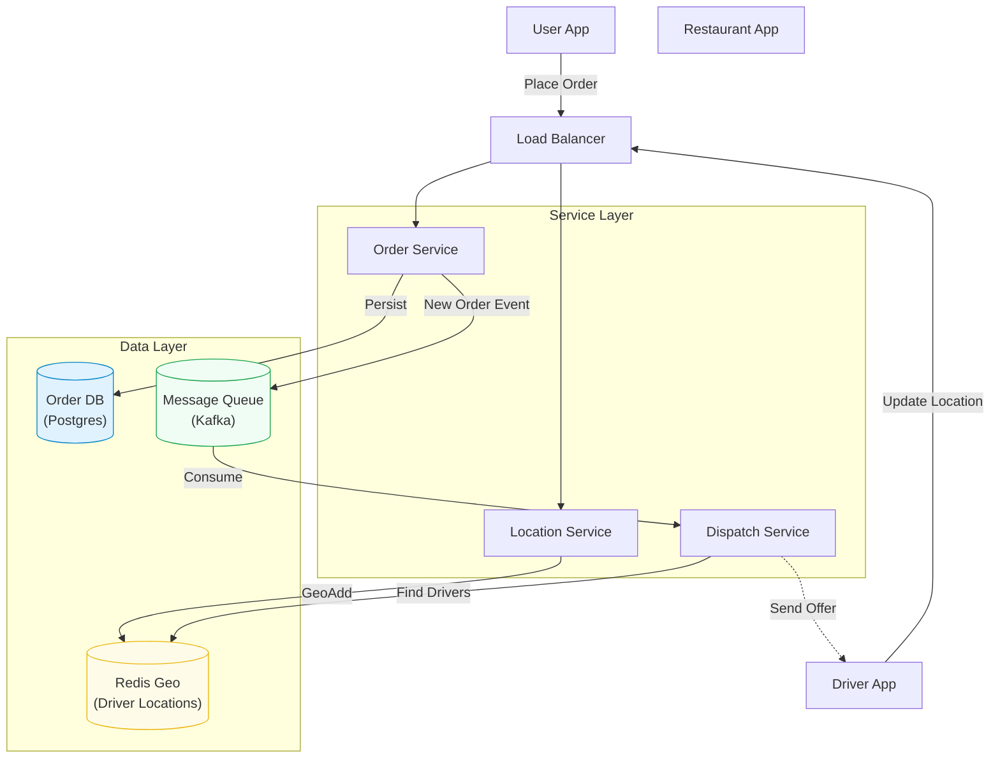

# Designing a Local Delivery Service (DoorDash / UberEats)

Design a 3-sided marketplace (User, Restaurant, Driver) for on-demand food delivery. This problem tests your ability to handle **real-time geospatial data**, **state machines**, and **matching algorithms**.

## 1. Functional Requirements

*   **Place Order**: Users can browse menus and place food orders.
*   **Dispatch**: System must assign a driver to pick up and deliver the order.
*   **Track Order**: Users can track the driver's location in real-time.
*   **Restaurant Portal**: Restaurants receive and acknowledge orders.
*   **Driver App**: Drivers receive job offers and update status (Picked Up / Delivered).

## 2. Non-Functional Requirements

*   **Low Latency**: Driver location updates and order status changes must be near real-time.
*   **Geospatial Accuracy**: Finding "Drivers near Restaurant" must be fast and accurate.
*   **High Availability**: The system handles millions of concurrent orders.
*   **Data Consistency**: We cannot lose an order or assign the same order to multiple drivers.

---

## 3. Core Entities / Schema

The data model connects Users, Restaurants, and Drivers via an `Order`.

### `Orders` Table
Primary source of truth.
| Column | Type | Description |
| :--- | :--- | :--- |
| `order_id` | `UUID` | PK. |
| `user_id` | `UUID` | FK. |
| `restaurant_id` | `UUID` | FK. |
| `driver_id` | `UUID` | nullable. Assigned Driver. |
| `status` | `ENUM` | CREATED, CONFIRMED, ASSIGNED, PICKED_UP, DELIVERED. |
| `total_price` | `DECIMAL` | |
| `created_at` | `TIMESTAMP` | |

### `DriverLocation` (Geospatial Store - Redis/PostGIS)
Ephemeral, high-frequency data.
*   **Key**: `driver_id`
*   **Value**: `{ lat, long, timestamp }`
*   **Index**: **Geohash** or **QuadTree** for radius queries.

---

## 4. API Design

### Place Order
`POST /api/v1/orders`
*   **Body**: `{ restaurant_id, items: [...] }`
*   **Resp**: `{ order_id, status: "CREATED" }`

### Update Driver Location (Heartbeat)
`POST /api/v1/driver/location`
*   **Body**: `{ lat, long }`
*   Frequency: Every 3-5 seconds.
*   **Note**: We don't persist every single point to the main DB. We keep the *latest* in Redis and flush to DB/S3 for analytics asynchronously.

### Get Nearby Drivers (Internal)
`GET /internal/dispatch/drivers?lat=...&long=...&radius=5km`
*   Returns list of available `driver_ids`.

---

## 5. High-Level Design

### Architecture Diagram

### Workflow
1.  **User** places order. `OrderService` saves to DB with status `CREATED`.
2.  **OrderService** publishes `ORDER_CREATED` event to Kafka.
3.  **DispatchService** consumes event.
4.  **DispatchService** queries **Redis Geo** for "Available drivers within 3km of Restaurant".
5.  **DispatchService** runs a ranking algorithm (Matching) and sends an offer to the best driver.
6.  **Driver** accepts. Order status -> `ASSIGNED`.

---

## 6. Deep Dives

### A. Geospatial Indexing (How to find nearby drivers?)
A standard SQL query (`WHERE lat > x AND lat < y...`) is slow because it scans two columns with no combined index.
*   **Geohash**: Encodes (lat, long) into a base32 string. Nearby points share the same *prefix*.
    *   Example: `9q8yy` is a box in San Francisco.
    *   Query: `SELECT * FROM drivers WHERE geohash LIKE '9q8yy%'`.
*   **QuadTree**: Recursively divides the map into 4 quadrants.
*   **Solution**: Use **Redis Geo** (which uses Geohashing internally). It's extremely fast for radius queries (`GEORADIUS key long lat 5 km`).

### B. Driver Dispatch & Matching
Simple approach: Find nearest driver.
**Better approach**: Global Optimization.
*   Don't just pick the closest. Pick the one that minimizes *overall* system wait time.
*   **Batching**: Assign 2 nearby orders to 1 driver if both are on the same route.

### C. Real-Time Tracking (WebSocket vs Polling)
Users want to see the car moving on the map.
*   **Long Polling**: Okay for "Order Status" (changes rarely).
*   **WebSockets**: Mandatory for "Driver Location" (changes every 3s).
*   **Flow**: Driver -> Location Service -> Kafka -> WebSocket Service -> User.

### D. Managing Order State (State Machine)
An order goes through a complex lifecycle.
*   `CREATED` -> `CONFIRMED` -> `PREPARING` -> `READY_FOR_PICKUP` -> `PICKED_UP` -> `DELIVERED`.
*   **Concurrency**: What if the User cancels *exactly* when the Driver accepts?
*   **Solution**: Database Row Locking (`SELECT FOR UPDATE`) or Versioning (Optimistic Locking) on the `Order` table to ensure atomic state transitions.

---

## Summary Checklist

- [ ] **Geospatial**: Redis Geo / Geohashing for fast location lookups.
- [ ] **State Machine**: manage order lifecycle atomically.
- [ ] **Real-time**: WebSockets for live tracking.
- [ ] **Dispatch**: Async matching via Message Queue.
