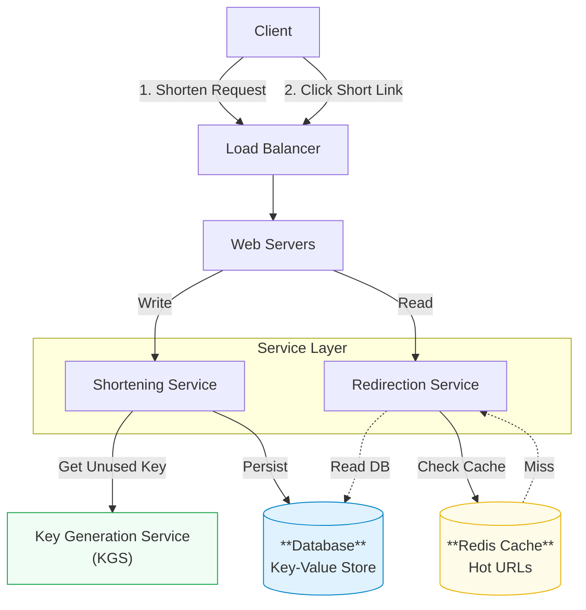

# Designing a URL Shortener (TinyURL / Bit.ly)

Design a scalable URL shortening service like Bit.ly or TinyURL. This is a classic system design interview question that tests your ability to handle high read traffic, generate unique IDs, and design simple but scalable data models.

## 1. Functional Requirements

*   **Shorten URL**: Given a long URL, generate a shorter, unique alias (e.g., `http://tiny.url/j8s9d`).
*   **Redirect**: When a user accesses the short alias, redirect them to the original long URL.
*   **Custom Alias** (Optional): Allow users to choose a custom short link (e.g., `http://tiny.url/my-blog`).
*   **Expiration** (Optional): Links can have an expiration time.
*   **Analytics** (Optional): Track click stats (e.g., click count, location).

## 2. Non-Functional Requirements

*   **High Availability**: The system must be incredibly reliable. If the redirection fails, the user cannot reach the destination.
*   **Low Latency**: Redirection should happen in milliseconds.
*   **Scalability**: Supporting billions of clicks per month.
*   **Read-Heavy**: The read-to-write ratio is high (e.g., 100:1). We read (redirect) much more often than we write (shorten).
*   **Durability**: Once a short URL is generated, it should persist (unless expired).

---

## 3. Core Entities / Schema

The data model deals with mapping a `ShortKey` to a `LongURL`. Since the relationships are simple, we can use a **NoSQL Store** (Key-Value) like DynamoDB or Cassandra for massive scale, or a **Relational DB** (PostgreSQL) if we want ACID properties for user accounts.

### `URLMapping` Table
| Column | Type | Description |
| :--- | :--- | :--- |
| **short_key** | `VARCHAR(7)` | **Primary Key**. The generated 7-char string. |
| **original_url** | `VARCHAR(2048)` | The destination URL. |
| **created_at** | `TIMESTAMP` | Creation time. |
| **expires_at** | `TIMESTAMP` | Expiration time (nullable). |
| **user_id** | `UUID` | Optional: Owner of the link. |

---

## 4. API Design

We need a RESTful API.

### Shorten URL
`POST /api/v1/data/shorten`

**Request Body:**
```json
{
  "long_url": "https://www.google.com/search?q=system+design",
  "custom_alias": "sys-design", 
  "expire_date": "2025-12-31" 
}
```

**Response:**
```json
{
  "short_url": "http://tiny.url/j8s9d"
}
```

### Redirect
`GET /:short_key`

**Response:**
*   **301 Permanent Redirect**: If the mapping creates a permanent association. Efficient (browser caches it) but you lose analytics visibility.
*   **302 Found (Temporary Redirect)**: Better for analytics. The browser hits your server every time, allowing you to track clicks.

---

## 5. High-Level Design

The flow is split into two paths: the **Write Path** (Shortening) and the **Read Path** (Redirection).

### Architecture Diagram



---

## 6. Deep Dives

### A. Hash Collision & Key Generation
How do we generate a unique `short_key`?

#### Option 1: Hashing (MD5 / SHA256)
*   Hash the `long_url` (e.g., MD5).
*   Take the first 7 characters.
*   **Problem**: Collisions. Different URLs might produce the same prefix.
*   **Solution**: If collision, append a sequence number or salt and re-hash. Expensive (requires DB check).

#### Option 2: Unique ID Generator + Base62 (Preferred)
*   Generate a unique integer ID (e.g., `100000000`).
*   Convert that ID to **Base62** ([a-z, A-Z, 0-9]).
*   **Why Base62?** It's URL-safe (Base64 has `+` and `/` which are tricky).
*   **Math**: $62^7 \approx 3.5$ Trillion combinations. Plenty for most apps.
*   **Distributed ID**: Use **Snowflake ID** or a **Key Generation Service (KGS)** that pre-generates keys and hands them to servers in batches.

### B. Database Scaling
Since we expect billions of records, a single database definition is insufficient. We need to **Shard**.

*   **Range Based Sharding**: Shard by first character ('a' goes to node 1, 'b' to node 2). **Cons**: Unbalanced validation (some prefixes are more common).
*   **Hash Based Sharding**: `Hash(short_key) % NumShards`. **Pros**: evenly distributed load.

### C. Caching (The Performance Booster)
Since the system is Read-Heavy (100:1), caching is critical.
*   **Cache Policy**: LRU (Least Recently Used).
*   **What to cache**: Top 20% of URLs generate 80% of traffic.
*   **Flow**:
    1.  Check Redis for `short_key`.
    2.  If found -> Return long URL immediately.
    3.  If miss -> Fetch from DB, write to Cache, return long URL.

### D. Concurrency & Race Conditions
If allowing custom aliases, two users might try to claim "apple" at the exact same time.
*   **Solution**: Database constraints (`UNIQUE` index on `short_key`). First write wins, second fails. Transactional locks can effectively manage this.

---

## Summary Checklist

- [ ] **Requirements**: Redirect (301 vs 302), Custom Alias.
- [ ] **API**: simple REST (POST/GET).
- [ ] **Data Model**: `short_key` as PK. NoSQL preferred for scale.
- [ ] **Hashing**: Base62 encoding of a Unique ID is better than partial MD5.
- [ ] **Caching**: Absolutely mandatory for low-latency reads.
