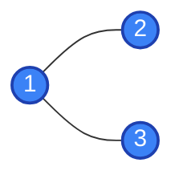
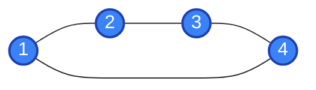

## Problem

Given a reference to a variable node which is part of an undirected, connected graph, write a function to return a copy of the graph as an adjacency list in dictionary form. The keys of the adjacency list are the values of the nodes, and the values are the neighbors of the nodes.

`node` is an instance of the following class, where `neighbors` is a list of references to other nodes in the graph (also of type `IntGraphNode`):

```python
class IntGraphNode:
    def __init__(self, value = 0, neighbors = None):
        self.value = value
        self.neighbors = neighbors if neighbors is not None else []
```

## Test Cases

**Example 1:**

**Input:**
```python
node = IntGraphNode(1, [IntGraphNode(2), IntGraphNode(3)])
```

**Output:**
```python
{1: [2, 3], 2: [1], 3: [1]}
```

**Visual representation:**



**Explanation:** 
- Node 1 is connected to nodes 2 and 3
- Node 2 is connected to node 1 (undirected edge)
- Node 3 is connected to node 1 (undirected edge)

---

**Example 2:**

**Input:**
```python
n1 = IntGraphNode(1)
n2 = IntGraphNode(2)
n3 = IntGraphNode(3)
n4 = IntGraphNode(4)

n1.neighbors = [n2, n4]
n2.neighbors = [n1, n3]
n3.neighbors = [n2, n4]
n4.neighbors = [n1, n3]
```

**Output:**
```python
{1: [2, 4], 2: [1, 3], 3: [2, 4], 4: [1, 3]}
```

**Visual representation:**



**Explanation:** 
- This forms a square/cycle graph
- Node 1 connects to nodes 2 and 4
- Node 2 connects to nodes 1 and 3
- Node 3 connects to nodes 2 and 4
- Node 4 connects to nodes 1 and 3

---

## Approach

This problem requires traversing the entire graph starting from a given node and building an adjacency list representation.

**Strategy:**

1. **Use DFS (or BFS) to traverse the graph:**
   - Start from the given node
   - Keep track of visited nodes to avoid infinite loops (since the graph is undirected)
   - For each node, record its value as a key in the adjacency list

2. **Build the adjacency list:**
   - For each node visited, iterate through its neighbors
   - Add each neighbor's value to the adjacency list for the current node
   - Recursively visit each neighbor if not already visited

3. **Handle edge cases:**
   - If the input node is `None`, return an empty dictionary
   - Use a `visited` set to track which nodes have been processed

**Key Points:**
- This is a graph traversal problem, not a cloning problem (we're creating an adjacency list, not cloning nodes)
- The undirected nature means when we see an edge A→B, we've also seen B→A
- DFS and BFS both work; DFS is slightly simpler to implement recursively

**Time Complexity:** O(V + E) where V is the number of vertices and E is the number of edges. We visit each node once and traverse each edge twice (once from each direction).

**Space Complexity:** O(V + E) for storing the adjacency list and the visited set.

## Solutions

### Python
```python
from typing import Dict, List
from collections import defaultdict

# class IntGraphNode:
#     def __init__(self, value = 0, neighbors = None):
#         self.value = value
#         self.neighbors = neighbors if neighbors is not None else []

class Solution:
    def copy_graph(self, node: IntGraphNode) -> Dict[int, List[int]]:
        graph: Dict[int, List[int]] = {}
        if not node:
            return graph
        
        visited = set()
        
        def dfs(node: IntGraphNode):
            if node in visited:
                return
            
            visited.add(node)
            # Initialize the adjacency list for this node
            graph[node.value] = []
            
            # Add all neighbors
            for neighbor in node.neighbors:
                graph[node.value].append(neighbor.value)
                dfs(neighbor)
        
        dfs(node)
        return graph
```

### C++
```cpp
/**
 * struct IntGraphNode {
 *     int value;
 *     vector<IntGraphNode*> neighbors;
 *     IntGraphNode(int val) : value(val) {}
 * };
 */
#include <unordered_map>
#include <unordered_set>
#include <vector>

class Solution {
private:
    std::unordered_set<IntGraphNode*> visited;
    std::unordered_map<int, std::vector<int>> graph;
    
    void dfs(IntGraphNode* node) {
        if (!node || visited.count(node)) {
            return;
        }
        
        visited.insert(node);
        // Initialize the adjacency list for this node
        graph[node->value] = std::vector<int>();
        
        // Add all neighbors
        for (IntGraphNode* neighbor : node->neighbors) {
            graph[node->value].push_back(neighbor->value);
            dfs(neighbor);
        }
    }
    
public:
    std::unordered_map<int, std::vector<int>> copyGraph(IntGraphNode* node) {
        graph.clear();
        visited.clear();
        
        if (!node) {
            return graph;
        }
        
        dfs(node);
        return graph;
    }
};
```

### Java
```java
/**
 * class IntGraphNode {
 *     int value;
 *     List<IntGraphNode> neighbors;
 *     IntGraphNode(int val) { value = val; neighbors = new ArrayList<>(); }
 * }
 */
import java.util.*;

class Solution {
    private Set<IntGraphNode> visited = new HashSet<>();
    private Map<Integer, List<Integer>> graph = new HashMap<>();
    
    private void dfs(IntGraphNode node) {
        if (node == null || visited.contains(node)) {
            return;
        }
        
        visited.add(node);
        // Initialize the adjacency list for this node
        graph.put(node.value, new ArrayList<>());
        
        // Add all neighbors
        for (IntGraphNode neighbor : node.neighbors) {
            graph.get(node.value).add(neighbor.value);
            dfs(neighbor);
        }
    }
    
    public Map<Integer, List<Integer>> copyGraph(IntGraphNode node) {
        graph.clear();
        visited.clear();
        
        if (node == null) {
            return graph;
        }
        
        dfs(node);
        return graph;
    }
}
```

### JavaScript
```javascript
/**
 * function IntGraphNode(value, neighbors) {
 *     this.value = (value===undefined ? 0 : value)
 *     this.neighbors = (neighbors===undefined ? [] : neighbors)
 * }
 */
/**
 * @param {IntGraphNode} node
 * @return {Object}
 */
var copyGraph = function(node) {
    const graph = {};
    if (!node) {
        return graph;
    }
    
    const visited = new Set();
    
    function dfs(node) {
        if (visited.has(node)) {
            return;
        }
        
        visited.add(node);
        // Initialize the adjacency list for this node
        graph[node.value] = [];
        
        // Add all neighbors
        for (const neighbor of node.neighbors) {
            graph[node.value].push(neighbor.value);
            dfs(neighbor);
        }
    }
    
    dfs(node);
    return graph;
};
```
