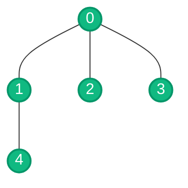
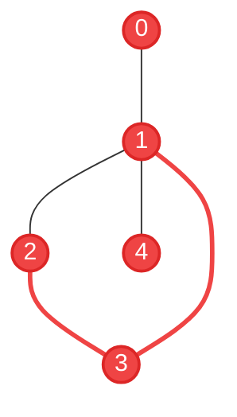
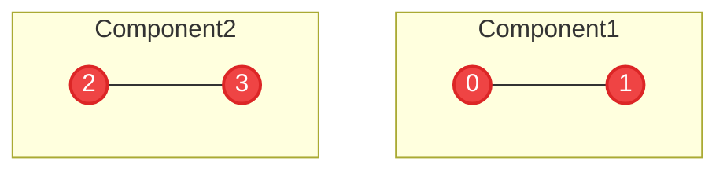

## Problem

You are given an integer `n` and a list of undirected edges where each entry in the list is a pair of integers representing an edge between nodes `0` and `n-1`. You have to write a function to check whether these edges make up a valid tree.

A valid tree must satisfy three conditions:
1. **Exactly n-1 edges** (a tree with n nodes has exactly n-1 edges)
2. **Connected** (all nodes are reachable from any starting node)
3. **No cycles** (there are no loops in the graph)

There will be no duplicate edges in the edges list (i.e., `[0, 1]` and `[1, 0]` will not appear together in the list).

## Test Cases

**Example 1:**

**Input:**
```python
n = 5
edges = [[0, 1], [0, 2], [0, 3], [1, 4]]
```

**Output:**
```python
true
```

**Visual representation:**



**Explanation:** 
- ✓ Has exactly 4 edges (n-1 = 5-1 = 4)
- ✓ All nodes are connected
- ✓ No cycles present
- **Result: Valid Tree**

---

**Example 2:**

**Input:**
```python
n = 5
edges = [[0, 1], [1, 2], [2, 3], [1, 3], [1, 4]]
```

**Output:**
```python
false
```

**Visual representation:**



**Explanation:** 
- ✓ Has exactly 4 edges? No, has 5 edges (should be n-1 = 4)
- ✗ Contains a cycle: 1 → 2 → 3 → 1 (highlighted in red)
- **Result: Not a Valid Tree**

---

**Example 3:**

**Input:**
```python
n = 4
edges = [[0, 1], [2, 3]]
```

**Output:**
```python
false
```

**Visual representation:**



**Explanation:** 
- ✗ Graph is not connected (has 2 separate components)
- The graph has two disconnected components: {0, 1} and {2, 3}
- **Result: Not a Valid Tree**

---

**Example 4:**

**Input:**
```python
n = 1
edges = []
```

**Output:**
```python
true
```

**Visual representation:**


**Explanation:** 
- ✓ A single node with no edges is a valid tree
- **Result: Valid Tree**

---

## Approach

A valid tree must satisfy three key properties:
1. Has exactly **n-1 edges**
2. Is **fully connected** (all nodes reachable)
3. Has **no cycles**

**Strategy:**

1. **Quick Edge Count Check:**
   - If `edges.length != n - 1`, immediately return `false`
   - This single check can eliminate many invalid cases early

2. **Build Adjacency List:**
   - Create a graph representation using an adjacency list
   - For each edge `[u, v]`, add `v` to `u`'s neighbors and vice versa

3. **DFS for Cycle Detection and Connectivity:**
   - Start DFS from node 0 with parent -1
   - For each node, mark it as visited
   - For each neighbor:
     - Skip if neighbor is the parent (to avoid false cycle detection in undirected graphs)
     - If neighbor is already visited, a cycle exists → return `false`
     - Recursively check the neighbor

4. **Verify Full Connectivity:**
   - After DFS, check if `visited.size() == n`
   - If all nodes were visited, the graph is connected
   - If not all nodes visited, the graph has disconnected components → return `false`

**Why This Works:**
- Edge count check ensures we have the right number of edges for a tree
- DFS with parent tracking detects cycles without false positives
- Visited count check ensures full connectivity
- Together, these three checks guarantee a valid tree structure

**Time Complexity:** O(V + E) where V is the number of vertices and E is the number of edges (DFS traversal)

**Space Complexity:** O(V + E) for the adjacency list and visited set

## Solutions

### Python
```python
from typing import List
from collections import defaultdict

class Solution:
    def graph_valid_tree(self, n: int, edges: List[List[int]]) -> bool:
        # Rule 1: must have exactly n - 1 edges
        if len(edges) != n - 1:
            return False
        
        # Build adjacency list
        adj_list = defaultdict(list)
        for u, v in edges:
            adj_list[u].append(v)
            adj_list[v].append(u)
        
        visited = set()

        def isCycle(node, parent):
            if node in visited:
                return True  # Cycle detected

            visited.add(node)
            for neighbour in adj_list[node]:
                if neighbour == parent:
                    continue
                if isCycle(neighbour, node):
                    return True

            return False
      
        # Rule 2 & 3: connected and no cycles
        if isCycle(0, -1):
            return False

        # Rule 2: all nodes must be visited (connected)
        return len(visited) == n
```

### C++
```cpp
#include <vector>
#include <unordered_map>
#include <unordered_set>

class Solution {
private:
    std::unordered_map<int, std::vector<int>> adjList;
    std::unordered_set<int> visited;
    
    bool isCycle(int node, int parent) {
        if (visited.count(node)) {
            return true;  // Cycle detected
        }
        
        visited.insert(node);
        for (int neighbour : adjList[node]) {
            if (neighbour == parent) {
                continue;
            }
            if (isCycle(neighbour, node)) {
                return true;
            }
        }
        
        return false;
    }
    
public:
    bool graphValidTree(int n, std::vector<std::vector<int>>& edges) {
        // Rule 1: must have exactly n - 1 edges
        if (edges.size() != n - 1) {
            return false;
        }
        
        // Build adjacency list
        adjList.clear();
        visited.clear();
        for (const auto& edge : edges) {
            adjList[edge[0]].push_back(edge[1]);
            adjList[edge[1]].push_back(edge[0]);
        }
        
        // Rule 2 & 3: connected and no cycles
        if (isCycle(0, -1)) {
            return false;
        }
        
        // Rule 2: all nodes must be visited (connected)
        return visited.size() == n;
    }
};
```

### Java
```java
import java.util.*;

class Solution {
    private Map<Integer, List<Integer>> adjList = new HashMap<>();
    private Set<Integer> visited = new HashSet<>();
    
    private boolean isCycle(int node, int parent) {
        if (visited.contains(node)) {
            return true;  // Cycle detected
        }
        
        visited.add(node);
        if (adjList.containsKey(node)) {
            for (int neighbour : adjList.get(node)) {
                if (neighbour == parent) {
                    continue;
                }
                if (isCycle(neighbour, node)) {
                    return true;
                }
            }
        }
        
        return false;
    }
    
    public boolean graphValidTree(int n, int[][] edges) {
        // Rule 1: must have exactly n - 1 edges
        if (edges.length != n - 1) {
            return false;
        }
        
        // Build adjacency list
        adjList.clear();
        visited.clear();
        for (int[] edge : edges) {
            adjList.computeIfAbsent(edge[0], k -> new ArrayList<>()).add(edge[1]);
            adjList.computeIfAbsent(edge[1], k -> new ArrayList<>()).add(edge[0]);
        }
        
        // Rule 2 & 3: connected and no cycles
        if (isCycle(0, -1)) {
            return false;
        }
        
        // Rule 2: all nodes must be visited (connected)
        return visited.size() == n;
    }
}
```

### JavaScript
```javascript
/**
 * @param {number} n
 * @param {number[][]} edges
 * @return {boolean}
 */
var graphValidTree = function(n, edges) {
    // Rule 1: must have exactly n - 1 edges
    if (edges.length !== n - 1) {
        return false;
    }
    
    // Build adjacency list
    const adjList = new Map();
    for (const [u, v] of edges) {
        if (!adjList.has(u)) adjList.set(u, []);
        if (!adjList.has(v)) adjList.set(v, []);
        adjList.get(u).push(v);
        adjList.get(v).push(u);
    }
    
    const visited = new Set();
    
    function isCycle(node, parent) {
        if (visited.has(node)) {
            return true;  // Cycle detected
        }
        
        visited.add(node);
        const neighbours = adjList.get(node) || [];
        for (const neighbour of neighbours) {
            if (neighbour === parent) {
                continue;
            }
            if (isCycle(neighbour, node)) {
                return true;
            }
        }
        
        return false;
    }
    
    // Rule 2 & 3: connected and no cycles
    if (isCycle(0, -1)) {
        return false;
    }
    
    // Rule 2: all nodes must be visited (connected)
    return visited.size === n;
};
```
